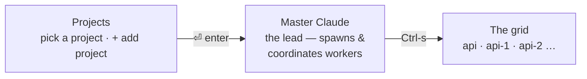

<p align="center">
  
</p>

**Run a fleet of Claude Code agents in parallel, from one terminal.** Each agent gets its
own git worktree; you get one screen that shows what every one of them is doing.

> A *ghost fleet* is a fleet of autonomous, unmanned vessels under one command — agents
> working with nobody in the seat, and one control plane steering them.

<p align="center">
  
</p>

<p align="center">
  <sub>Recorded by <a href="worktree.tape"><code>worktree.tape</code></a> against a real
  fleet — <code>w</code> on a project's grid cuts a worktree, branches it, and boots an
  agent in it.</sub>
</p>

## Why another one of these

Orchestrating agents is easy to demo and hard to trust. The parts that took real
debugging — and that most wrappers get wrong:

| problem | what ghostfleet does |
| --- | --- |
| "is it working?" — the transcript's mtime says idle mid-generation, and busy when a background write lands | reads the live pane, the same signal you read |
| a worker needs you, you handle it, the card stays red forever | a `need-you` older than the session's own activity is treated as spent |
| every project has a session called `master`, so their statuses collide | status is scoped by the fleet's socket, not by name |
| a dispatched prompt silently lands in the input box without submitting | dispatch waits for the paste, submits, then verifies a turn actually started |
| one account: 5 agents drain the budget 5× faster and all stall together | a non-Claude governor meters usage and parks workers at the ceiling, resuming on reset (it can't be the lead — the lead stalls too) |
| you already run agents by hand in a dozen panes | `fleet-adopt` finds those conversations and rebuilds them as one fleet |

## Prerequisites

| requirement | why |
| --- | --- |
| `git` | worktrees **are** the isolation model — a worker is a checkout on its own branch. `fleet-spawn` refuses to run without it |
| `claude` ([Claude Code](https://github.com/anthropics/claude-code)) | what a session runs by default, and what the pane detectors are written against |
| `node` (v18+) | the grid is a zero-npm-dependency Node TUI |
| `tmux` | the hidden substrate that keeps sessions alive in the background — missing? the installer offers to install it for you (see below) |
| `jq` | the status/notification hook parses its JSON payload with it |
| macOS, Linux, or **Windows via WSL2** | sessions are tmux servers, and tmux is POSIX-only — see the native-Windows note below |
| `codex` / `opencode` (optional) | alternative agents, chosen per worktree on the `w` form. Their pane signals are detected separately — see [docs/multi-agent-sessions.md](docs/multi-agent-sessions.md) |
| `$EDITOR` (optional, default `nvim .`) | what `Ctrl-n`'s editor tab opens. Any editor works — override with `CLAUDE_FLEET_EDITOR`. No particular Neovim distribution is involved; if `nvim` isn't installed, set the variable to what you use |
| `tailscale` (optional) | **only** for the phone client, and only off-LAN: it is how `fleet-serve` is reachable without exposing a port — see [docs/mobile.md](docs/mobile.md) |
| `zellij` (optional) | not required, but the included layout gives you one pane that frees `Ctrl-s`/arrows from its own bindings |
| `terminal-notifier` + [AeroSpace](https://github.com/nikitabobko/AeroSpace) (optional, macOS) | for **clickable** notifications that jump straight to the fleet — see [Notifications](#notifications) |

*(Native Windows isn't supported and won't be: sessions are tmux servers, and tmux is
POSIX-only. Under WSL2 it's just Linux and works the same — that path is untested by
me, so file an issue if something bites.)*

## Install

```bash
brew install jq             # macOS — apt/dnf/pacman on Linux (tmux missing? installer offers to get it)
git clone https://github.com/PabloG55/ghostfleet.git
cd ghostfleet
./install.sh
ghostfleet
```

**Do not run `npx ghostfleet`.** That name on npm belongs to an unrelated project —
`ghostfleet@0.0.2`, published by someone else, and confusingly close in pitch ("fleets of
disposable AI agents in your own cloud"). Running it installs a stranger's package, not
this one. This repo's `package.json` still claims that name and so cannot be published
under it; the shim it points at (`bin/npx-install.mjs`) is fine and just runs `install.sh`,
so the only thing missing is a name that is actually free. `ghostfleet-cli`,
`claude-ghostfleet`, `ghost-fleet` and `gfleet` were unclaimed at the time of writing, and
a scoped `@you/ghostfleet` is always available.

Cloning is also what you want if you intend to edit ghostfleet itself: `cf-sync` syncs the
runtime **from a real repo**, and an npx cache is not one.

Missing `tmux`? The installer detects it, works out the right package manager for your
OS (Homebrew, apt, dnf, yum, pacman, zypper, or apk), and asks before running anything
— it never installs (or `sudo`s) without you confirming. No package manager recognized,
or you say no? It just tells you the command to run yourself.

The installer **stages the runtime** — it copies `bin/`, `hooks/`, `mcp/`, `skill/`, and
`layouts/` out of the repo into `~/.local/libexec/ghostfleet` (override with `CLAUDE_FLEET_HOME`)
— then symlinks the commands (`ghostfleet`, `claude-here`, `cf-sync`, and the `fleet-*` helpers)
into `~/.local/bin` **pointing at the staged copy**; wires the status + notification hooks into
every Claude config dir it finds (`~/.claude`, `~/.claude-*`, backing each up), plus a `PreToolUse`
guard that stops Claude Code's built-in `EnterWorktree` from walking a fleet session off its own
checkout (it is *appended* to `PreToolUse`, so hooks you already have there survive); **registers the
fleet MCP server** into each config dir's `.claude.json` via `claude mcp add -s user` (Claude Code
reads MCP from `.claude.json`/`.mcp.json`, *not* `settings.json`); installs the
`ghostfleet-orchestrate` skill; and links the zellij layout. Re-run any time; it's idempotent.

<details>
<summary>Why the runtime is staged out of the repo (macOS TCC)</summary>

macOS guards `~/Documents`, `~/Desktop`, and `~/Downloads` with **TCC**. An app that hasn't been
granted *Documents folder* / *Full Disk Access* — notably **ClaudeCode.app** — gets
`Operation not permitted` when it tries to **execute** anything stored there. So if you cloned this
repo under `~/Documents`, running the fleet CLI, the event hook, or the MCP server *directly from
the repo* breaks the instant such an app hosts your session (symlinks don't help — exec follows them
back into the protected folder). `~/.local` is **not** TCC-protected, so the installer runs
everything from the staged copy there and the repo stays purely for development.

**After you edit the repo, run `cf-sync`** to push those edits into the live runtime (it copies the
runtime dirs from the recorded source repo into `~/.local/libexec/ghostfleet`; the PATH symlinks,
hook, and MCP already point there, so no re-link is needed). The alternative — granting ClaudeCode.app
Full Disk Access — also works but can reset on app/OS updates; staging survives updates.

</details>

## The screens

One terminal window (or one zellij pane) — `ghostfleet` is the whole control plane:



`` ` `` (backtick) always steps back exactly one level, from anywhere — session → grid → master
→ Projects — no matter which shortcut you took *down*.

- **Projects** — pick a project and `⏎` drops you straight into its **Master Claude**. Each
  project has its own hidden tmux server (`cf-<project>`) holding its sessions.
- **Master Claude** — the lead session that spawns worktrees and coordinates workers.
- **The grid** — a card per Claude session (status · branch · last message), plus a card for
  every worktree that has **no** live session yet. Every session keeps running in the
  background, so agents work in parallel while you jump between them.
- **The stack** (`t` from the grid) — several of those sessions on screen *at the same time*, in
  split panes, including sessions from different projects.

```bash
zellij --layout fleet attach -c fleet    # one zellij session runs everything
# or just run `ghostfleet` in any pane
```

What makes it different: it runs *beside* your setup instead of taking it over. Sessions live on
per-project tmux servers ghostfleet manages for you, so you never lose a session by closing a
window — and if you use zellij, it stays a single pane instead of commandeering your multiplexer
(Claude Squad, ccmanager) or pushing you to a web dashboard (Omnara).

## Everyday shortcuts

The handful of keys that cover almost everything you'll do — switching projects, entering a
worktree, creating a new one. Everything else (scheduling, cycling, per-session settings) is a
nice-to-have documented in **[docs/SHORTCUTS.md](docs/SHORTCUTS.md)**.

`` ` `` (backtick) is the universal **back** everywhere below — it steps out one level, mirroring
detach. `q` does the same on the grid. The levels are

```
Projects  →  master  →  the grid  →  a session
```

and one **back** always steps up exactly one of them, *however you got in* — jump straight into a
session with `Ctrl-f 1 1` and backing out still walks you through that project's grid and master.
`Ctrl-p` is the express lane when you did mean to leave the project entirely. **Projects** is the
root: fully exiting to the shell takes **`Ctrl-C` twice** (a single stray key can't drop the whole
control plane).

### Projects — pick what to work on

| key | does |
| --- | --- |
| `↑↓←→` / `hjkl` | move |
| `⏎` | open that project's **Master Claude** |
| `Ctrl-s` | skip master, go **straight to that project's grid** |
| `Ctrl-t` / `Ctrl-n` | a **terminal / editor** at that project's root, without booting its master first |
| `Ctrl-x` | that project's **stack** screen |
| `+ add project` → `⏎` | browse to a root folder that holds your checkouts/worktrees |
| `x` | remove a project from the list (sessions + history untouched) |
| digit `1`-`9` | jump straight to the project at that position |

### The grid — switching between worktrees, creating and deleting them

| key | does |
| --- | --- |
| `↑↓←→` / `hjkl` | move |
| `⇧h` `⇧j` `⇧k` `⇧l` | **reorder** the selected card (persisted — see below) |
| `⏎` | enter the selected card full-screen |
| a **`· FREE`** card (grey) | a worktree with no live session — `⏎` attaches directly, no prompt |
| `n` | new session on a checkout — lands on a **naming screen** (edit or accept the suggested name), then resumes if that checkout already has a conversation |
| `N` | same, but the conversation is **forced blank** |
| `w` | **new worktree** — a fresh checkout on its own branch, with a session started in it (below) |
| `t` / `Ctrl-x` | the **stack** — several sessions on screen at once, across projects (below) |
| `Ctrl-t` / `Ctrl-n` | a **terminal / editor tab** on the selected card's folder (below) |
| `x` | kill the session — or, on a `· FREE` card, **remove that worktree** (asks `y` to confirm) |
| `,` then `l` | **label** the session — the card is titled whatever you type, the session keeps its name |
| `q` / `` ` `` | back to master |
| digit `1`-`9` | jump straight to the card at that position |

**The second line names the worktree**, with the branch appended only when it says
something different — `doc-verify-stepper · acord-document-verification`, or just
`billing-retry` when the two match. It used to read *branch or folder*, so the branch
always won and the checkout a session was actually sitting in never appeared.

**A label is display only.** `,` then `l` titles a card whatever you like — *"PR 964 doc
verify"* — while the tmux session keeps its name. That separation is deliberate: the
session name is what `fleet-send` addresses, what the `Ctrl-f` chord counts, and what
`fleet-rename` keeps equal to the worktree's folder for the rest of the fleet. So a
labelled card shows **`<session> · <worktree>`** underneath, because a card titled
*"PR 964 doc verify"* otherwise tells you nothing about what to type. Empty clears it.

**Reordering matters more than it looks.** The card order *is* the fleet's numbering: the digit
printed on a card, `1`-`9`, `Ctrl-f <project> <session>` and `⇧←→` cycling all count the same
list. Move a card and every one of them follows it, so the worker you keep coming back to can
live at `1`. The order is saved per fleet and survives leaving the grid.

`w` asks for a name, a branch (defaults to the name) and a base ref, then hands the job to
`fleet-spawn` — so the new branch is cut from the *right* place (it prefers the remote tip when
your local ref is behind, and your local one when it's ahead), `node_modules` is symlinked in so
lint and tests run, and you land in the session. `x` on a `· FREE` card removes a worktree's
checkout; the **branch is left alone**, and a dirty tree is refused until you confirm again with
`f`. From a lead session the same jobs are `fleet-spawn` and `git worktree remove` — see
[Orchestrate](#orchestrate-a-lead-session-driving-workers) below.

### The stack — watching two workers at once

`t` on the grid opens a screen listing every live session in **every** project. `space` marks the
ones you want, `⏎` puts them side by side in split panes — one project's worker on the left,
another's on the right, both live and typable.

```
── superkey · master ─────────────────┬── ghostfleet · stack-view ───────────
  ✻ Flowing… (18s · thinking)         │  ⏺ ran the suite: 131 passed
  ● master ▏3 workers                 │  ● stack-view ▏
```

Panes cannot cross tmux servers and every project *is* a server, so each pane runs a nested
`tmux attach` into that project's fleet. Three practical consequences:

- **Leaving detaches, it never kills.** `` ` `` closes the whole stack; every session keeps
  running exactly where it was.
- **`⇧←/→` moves focus between the panes** (wrapping at both ends), and so does **clicking one**.
  `⇧←→` is the one key the stack had to take from the fleet, and it costs nothing: `Ctrl-a ←/→`
  still cycles which session a pane shows, because the stack has no prefix of its own.
- **`Ctrl-a <` / `Ctrl-a >` moves the PANE** you are in one slot along the row, wrapping the same
  way — so you can arrange the projects in the order you want to read them. The new order is
  written back to `stack.tsv`, so it is still there the next time you open the stack. (`Ctrl-a {`
  and `Ctrl-a }` do the same, since those are tmux's own move-a-pane keys. `⌃⇧←/→` does it in one
  chord if your terminal sends it — Apple Terminal does not, see
  **[docs/stack-view.md](docs/stack-view.md)**.)
- **Everything else still reaches the agent.** `Ctrl-a …`, `Ctrl-s`, `Ctrl-p`, `Ctrl-f`, the
  wheel and drags all pass through to the fleet inside the pane as usual — a click both focuses
  the pane *and* reaches Claude. The only other key the stack takes is `` ` ``, which the fleet
  already took.
- **Panes are narrow, and Claude reflows to fit.** That is fine for reading and typing, but the
  governor cannot scrape the 5h usage figure out of a pane under ~100 columns — Claude truncates
  its status line rather than wrapping it. Details, and the busy-detector fix that came out of
  measuring this, are in **[docs/stack-view.md](docs/stack-view.md)**.

Membership persists in `$CLAUDE_FLEET_DIR/stack.tsv`, so the stack survives leaving the screen.
`fleet-stack open --dry-run` prints what it would build without touching anything.

### Inside a session

`Ctrl-a` then `g` (mnemonic **g**rid) detaches back a level — or `Ctrl-a d`. From **master**,
`Ctrl-s` (or `Ctrl-a s`) opens the session grid instead. The session keeps running.
(`Ctrl-a` is the tmux prefix; press it twice to send a literal `Ctrl-a` to Claude.)

### Tabs — a terminal or an editor on the session's own folder

| key | does |
| --- | --- |
| `Ctrl-t` | a **terminal** on this session's folder — a login shell in the pane's current path |
| `Ctrl-n` | an **editor** on the same folder — `$EDITOR` (default `nvim .`), override with `CLAUDE_FLEET_EDITOR` |
| `` ` `` | back to the session you opened the tab from |
| **drag** | select **and copy to the clipboard** — no prefix, no modifier. Double-click a word, triple-click a line |

Drag-to-copy needs code because `mouse on` means tmux captures the drag: the terminal's
own selection never happens, and what you highlight lands in tmux's *private* buffer —
looking selected while not being on your clipboard. `bin/fleet-copy` picks the clipboard
tool at run time (`pbcopy` / `wl-copy` / `xclip` / `xsel` / `clip.exe`), and
`set-clipboard on` also emits OSC 52 so a selection makes it back to your machine when
the fleet is over SSH.

Attached to a worker, wanting a shell in *its* worktree used to mean detaching, finding the
directory and `cd`-ing there. These work from the grid and the Projects screen too, where they
act on the selected card's folder / the project's root — the same chord means the same thing on
every screen.

Unlike every other key here, a tab **does not detach**: it's another session on the same tmux
server, so you land there instantly, and `` ` `` brings you back to where you opened it from
rather than up to the grid. One tab per kind per session, reused — pressing `Ctrl-t` twice
returns you to the terminal you already have.

**A tab is a session, not a window, and it is not a card.** The session part is load-bearing:
every status reader here captures with `capture-pane -t "$SESSION"`, which resolves to a
session's *current window*, so a shell window would make the grid read the shell instead of the
agent, the governor park a working session, and `fleet-send` paste your prompt into the shell.
The not-a-card part is too — a card claims a *number*, so a terminal renumbered every session
behind it and broke what `1`-`9`, `⇧←→` and `Ctrl-f <p> <s>` point at. So tabs are hidden from
the grid, the ring and the numbering, and named `_term-…` / `_edit-…` so the agent machinery
leaves them alone.

### Where a worktree goes, and which ones you can reuse

`w` puts a worktree beside the repo — unless the repo says otherwise. A repo that runs
its own worktree doctrine (a `.worktrees/` directory, or one declared in `.gitignore`)
gets its worktrees there instead. `CLAUDE_FLEET_WORKTREE_DIR` overrides either way;
`sibling` forces the classic layout.

This matters when the repo *enforces* its convention. superkey has a `PreToolUse` guard
that denies any edit whose path lacks `.worktrees/` — it never asks git whether the path
*is* a worktree — so a sibling worktree was refused as "the shared main checkout", the
agent obeyed the refusal, and created a **second worktree nested inside the first**, plus
a full dependency install. Two worktrees per task, with the session attached to the one
that wasn't being edited.

**A project can also be several clones.** `fleet-worktrees` spans every clone under the
project root, not just the one you're standing in. superkey registers `~/superkey`, which
isn't a repo at all — it holds four independent clones, each owning its own worktrees. A
lead saw 2 and was blind to the other 17, so *reuse before proliferate* could never fire
and every task made another one. `--here` restricts it to the current repo.

### Updating Claude Code under a fleet

Fleet sessions run with `DISABLE_AUTOUPDATER=1`. Claude Code's background-service
supervisor watches its own executable's mtime and self-restarts when it moves — but the
updater is still writing that ~300MB file, so the exec lands on a path that exists, has
a fresh mtime, and isn't executable yet:

```
[supervisor] binary at …/claude.exe changed (mtime changed) — self-restarting for upgrade
[supervisor] upgrade self-respawn failed to spawn: EACCES: permission denied … bg workers may be orphaned
```

The session then drops into the **agents view** carrying `Couldn't restart the
background service`. It self-heals in ~2s, which is why it persists as an annoyance
rather than getting fixed. A fleet makes it routine instead of rare: one update swaps
the binary under *every* live session at once, so they all lose the race together.

So update deliberately, with the fleet idle:

```bash
npm i -g @anthropic-ai/claude-code     # or however you installed it
```

The cost is real: **a long-lived fleet drifts behind the released version until you do.**
`CLAUDE_FLEET_AUTOUPDATE=1` opts back in.

## Orchestrate: a lead session driving workers

Because every session lives on the same tmux socket, a "lead"/**master** session can dispatch
work to siblings, watch them, unblock them, and manage cost — turning a fleet into
lead-and-workers (e.g. an `api` lead handing briefs to `api-1` / `api-2` worktrees). All of it
is callable from a session's Bash (or the `fleet_*` MCP tools).

**The lead's loop — look before you act.** Fleet state lives on disk (worktrees + a manifest of
what each was spun up for), not in the lead's head, so it *reads* the state instead of guessing —
which is what keeps a long-running or restarted lead from getting lost:

1. **`fleet-worktrees`** + **`fleet-inbox`** — what exists / what's free, and who needs you.
2. **Reuse a free worktree** before creating one — `fleet-spawn` refuses to proliferate (it lists
   the free ones) unless you `--reuse <wt>` or `--new`.
3. **`fleet-answer`** to unblock a stuck worker; **`fleet-pause`** to shed cost.

| goal | command |
|------|---------|
| every worktree + which are **FREE** | `fleet-worktrees` |
| live sessions + status | `fleet-list` |
| who needs you / what **finished** (drains since last look) | `fleet-inbox` |
| dispatch a self-contained brief | `fleet-send <session> "…"` |
| **ask** one and get the answer back | `fleet-send --reply-to me <session> "…"` |
| read a worker's last N messages | `fleet-read <session> [n]` |
| **reuse** a free worktree for a worker | `fleet-spawn <name> --reuse <wt> --prompt "…"` |
| **recycle** a worktree onto a fresh branch | `fleet-spawn <name> --reuse <wt> --branch <new> --from main` |
| new worktree (only if none free) | `fleet-spawn <name> [--branch b] [--from ref] --new --prompt "…"` |
| unblock a worker stuck on a dialog | `fleet-answer <session> "2"` |
| park / resume a worker (cost) | `fleet-pause <session>` · `fleet-resume <session>` |
| **rename** a worker + move its worktree | `fleet-rename <session> <new-name>` |
| **stop** a worker for good (or a dead orphan) | `fleet-stop <session>` |
| the checkout's **dev-stack slot** | `fleet-slot of <path>` · `fleet-slot list` |

### Dev-stack slots — one integer per checkout

Several checkouts of one repo each need their own local stack: an API port, a web port,
a database, a bucket. Picking those by hand per worktree is how two of them end up sharing
a database for a fortnight with nothing to notice.

`fleet-spawn` now hands every checkout one integer that **nothing else in the fleet
holds** — across every project *and* every profile — and puts it in the session's
environment as `CLAUDE_FLEET_SLOT`. Your repo derives the rest:

```bash
N=$(fleet-slot of "$PWD")       # 0 for the project's primary checkout
API_PORT=$((4000 + N))          # …and whatever else your stack needs
```

**ghostfleet allocates the number and nothing else.** It doesn't know what a port is,
which database you run, or what your stack is called — those formulas belong to the repo
that owns those names. That's what lets one allocator serve repos sharing no conventions.

**Slot 0 is the project's primary checkout** and is never allocated, so the checkout you
already work in keeps the ports it always had — adopting this changes nothing about a
machine that's already set up. "Primary" means the checkout the project is *registered*
at (the one `master` runs in), not "the first entry of `git worktree list`" — sibling
clones are each their own repo's first entry, and that test would hand `0` to all of them.

Claims are **idempotent by path**, so `--reuse` keeps its slot and therefore its
already-migrated database — which is what makes reuse cheaper than a fresh worktree
rather than merely tidier. `fleet-stop` releases; `fleet-clean` reclaims slots whose
checkout is gone by any route. `fleet-worktrees` shows the column.

**An empty answer is not zero.** `N=$(fleet-slot of "$PWD")` then `$((4000 + N))` yields
`4000` for a checkout nothing ever claimed — the primary's port, i.e. the exact silent
collision this removes, reintroduced at the commonest ad-hoc entry point (a plain `git
worktree add`). Boot scripts should call **`claim`**: it's idempotent, and it answers `0`
only for a registered primary.

**Pin the primary when the guess would be wrong.** `<root>/<name>`, else the first child
repo, else the root — fine for a project registered at its repo or at a container named
after it. It is wrong for a container holding several clones *and* unrelated products,
where the child-scan can hand slot 0 to a different product. Name it explicitly, one
`<project><TAB><path>` per line:

```
~/.config/ghostfleet/primaries
myrepo	/Users/me/work/myrepo
```

### `.ghostfleet/post-create` — the repo sets its own worktree up

A fresh worktree inherits no dependencies. ghostfleet symlinks the main checkout's
`node_modules` in, which is right for a single-package repo and **wrong for a pnpm
workspace**: the root `node_modules` links workspace packages by *relative* path, so a
symlinked tree resolves every workspace import from the symlink's real location — the
main checkout's source. Silent cross-tree contamination, and an install afterwards writes
straight through the symlink into that checkout.

So if a repo ships an executable `.ghostfleet/post-create`, `fleet-spawn` runs it in the
new worktree **instead of** symlinking (force it back with `CLAUDE_FLEET_LINK_NM=1`). It
runs after the slot is claimed, with `CLAUDE_FLEET_SLOT` and `CLAUDE_FLEET_WORKTREE` set,
so a hook can provision per-slot state as well as install. It is synchronous — the lead
waits — because the alternative is a worker whose first test run fails for a reason that
has nothing to do with its task. A failure is loud, not fatal.

The allocation is a directory of marker files (`~/.config/ghostfleet/slots/`) rather than
a table, because leads spawn concurrently and a read-modify-write over a shared free list
has nothing serialising it — two spawns would both take the lowest free number, which is
the collision this removes. There's no lock to reach for either (`flock(1)` isn't on
macOS), so creating the marker under `set -C` *is* the atom: it succeeds for exactly one
racer, and the directory listing is the free list.

```bash
fleet-worktrees                 # → "Free to reuse: api-3"
fleet-inbox                     # → api-1 DONE (feat/x) · api-2 NEEDS YOU: run tests?
fleet-answer api-2 "2"          # unblock the one waiting on a dialog
fleet-spawn fix-auth --reuse api-3 --branch feat/auth --from main \
  --prompt "Fix token refresh in src/auth/*. Done when auth tests pass."
fleet-read fix-auth 3           # check progress
```

The **inbox carries completion too**: a worker's turn ending shows as `DONE`, so
you learn when a brief is ready to review/merge without polling — and with
`CLAUDE_FLEET_NOTIFY_LEAD=1` the lead is **woken** on `done`/`need-you` (debounced)
so it acts hands-off instead of polling at all (see [Config](#config)). A fresh worktree
gets the main checkout's `node_modules` symlinked in (workers can run
lint/typecheck/tests; opt out with `CLAUDE_FLEET_LINK_NM=0`), and `--from` bases a
branch on your **local** ref — falling back to the remote tip only when local is
*behind* — so a worker never misses just-committed, unpushed work.

**Asking, not just dispatching.** A plain send is one-way: the target works, its turn ends, and
that `done` goes to **its own** fleet's master — so a question sent to another project looked
ignored no matter how long you waited. `--reply-to me` (MCP: `reply_to: true`) makes it a
conversation, and the answer comes back two ways:

```bash
fleet-send -s cf-getmycoi --reply-to me master "Does your /cois endpoint dedupe by externalId?"
# → arrives in your session as a message from getmycoi/master, even mid-turn
# …or, if it couldn't reach you, without polling:
fleet-inbox        # → 14:05  getmycoi/master  ANSWERED  yes — same externalId returns deduped:true…
fleet-read -s cf-getmycoi master 3      # the full reply
```

Every fleet session is **named `<project>/<session>`** for Claude Code's cross-session messaging
(`claude-here` passes `--name`; the derived default was `broker-agencies-61`, which nothing could
address), so the target is asked to answer you *directly* with `SendMessage`. That lands in your
session whatever you are doing — the case the relay below is worst at.

The **turn-end relay is the fallback**, and it's the reason `--reply-to` still leaves an address
next to the target: it covers an asker that isn't an addressable peer (a session started before
this, or renamed since), a **codex/opencode** target that has no such tool, and a turn that dies
before it gets there. The target is told to do both, so ending its turn is still an answer. Only
the turn your prompt actually starts answers (a prompt that queued behind a running turn doesn't
answer with that turn's work), a mid-request permission block reaches you too as `ASKS`, and one
request gets exactly one answer — a delivery the fleet can *prove* landed suppresses the row, so
you never read the same answer twice.

These are also exposed as **MCP tools** (`fleet_list` / `_send` / `_read` / `_spawn` /
`_worktrees` / `_inbox` / `_answer` / `_pause` / `_resume` / `_rename` / `_stop`) via a
dependency-free stdio server (`mcp/fleet-mcp.mjs`) that `install.sh` registers in each config dir.
The installed **`ghostfleet-orchestrate` skill** teaches a lead the loop above — reuse before
spawn, pull the inbox instead of polling every sibling, unblock with `fleet-answer`, mind the
shared budget — so you can just say *"work on a worktree to fix X"* and it reuses a free one. Each
session knows its fleet via `CLAUDE_FLEET_SOCK`; prompts must be self-contained (siblings don't
share your context). Another **project's** fleet is reachable too — `-s <socket>` from a shell, or
`project: "<name>"` on any of the MCP tools (`fleet_projects` lists the names). That includes
**starting a worker in another project**: `fleet_spawn` and `fleet_worktrees` are the two that
find the repo from the directory they run in rather than from a socket, so `project` puts them in
that project's checkout — the new worker lands on its fleet, on its branch, with its default
agent, without the lead needing to know where any of that lives.

**Budget.** One account funds the whole fleet, so wide fan-out drains it N× faster and everyone
stalls at the ceiling together. A **governor** (a dumb non-Claude loop, auto-started per fleet)
parks the newest workers as usage nears the ceiling and resumes them when the window resets; those
events show up in `fleet-inbox`. Opt out with `CLAUDE_FLEET_GOVERNOR=off`, watch-only with `=dry`.

## How it works

- **One tmux server per project** (`tmux -L cf-<project>`) is the hidden substrate. It keeps each
  Claude session alive in the background and handles attach / detach / resize — the battle-tested
  part. You never interact with tmux directly.
- **`ghostfleet`** is a tiny loop: it runs the grid, and when you pick a card it hands off to
  `tmux attach`. Detach and the loop redraws the grid. Node never owns PTYs.
- **`fleet-grid.mjs`** is a flicker-free Node TUI (zero npm deps). Each card joins three sources:
  the tmux session list, the per-session status file that the Claude hooks write to
  `~/.claude/fleet/`, and the last assistant line from the transcript in `~/.claude/projects/`.
  Worktrees with no live session are read straight from `git worktree list`. Card order is its
  own fourth source (`<sock>.order`, rewritten by `⇧hjkl`) — and the single one, since
  `ghostfleet` counts `Ctrl-f <p> <s>` through `fleet-grid.mjs --order` rather than re-deriving
  it, and `fleet-cycle` reads the copy mirrored onto the tmux server as `@cf_order`.
- **`claude-here`** is what each session runs, so sessions resume by checkout. If a
  conversation was registered as a Claude Code **background agent** (e.g. it was
  backgrounded, or created by a bg workflow), a plain `--resume` is refused with
  "currently running as a background agent" — so `claude-here` detects that (via
  `claude agents --json`) and resumes with `--fork-session`, branching an
  interactive copy with full history. The fork becomes the newest conversation, so
  the next open resumes it cleanly.

Status per card: `● NEEDS YOU` (permission/question) · `◆ working` · `✓ ready` · `· idle` ·
`· FREE` (worktree, no session).

## Config

`ghostfleet` sets these per project; each spawned session inherits them (used by the grid, hooks,
and `fleet-*` tools):

| Env var               | Meaning                                                          |
| --------------------- | --------------------------------------------------------------- |
| `CLAUDE_FLEET_SCOPE`  | The project name (shown in the header; scopes checkout discovery).|
| `CLAUDE_FLEET_ROOT`   | The project's root folder (where its checkouts/worktrees live).  |
| `CLAUDE_FLEET_SOCK`   | The project's tmux socket, `cf-<project>`.                       |
| `CLAUDE_CONFIG_DIR`   | The account/config dir for the project's `profile`.              |
| `CLAUDE_FLEET_DIR`    | Per-session status files (`$CLAUDE_CONFIG_DIR/fleet`).           |
| `CLAUDE_FLEET_YOLO`   | `0` to require permission prompts in sessions (default: bypass). |
| `CLAUDE_FLEET_AWAKE`  | `display` to keep the screen on as well as the machine; `off` to inhibit nothing. Default `on`. See [Staying awake](#staying-awake). |
| `CLAUDE_FLEET_NOTIFY_LEAD` | `1` to **push** worker `done`/`need-you` events to the lead instead of it polling. See [docs/SHORTCUTS.md](docs/SHORTCUTS.md) for the per-project/per-session settings-page toggle and the full precedence rules. |

`ghostfleet <project> --plain` prints a one-shot, non-interactive table for that project (scripts).

---

## Advanced & special cases

Everything below is real, but you'll reach for it far less often than what's above — multi-account
setups, migrating an existing scattered workflow, notification tuning, and the mechanics behind a
couple of conveniences.

### Already running Claude by hand? Adopt it

If you already work the scattered way — a Claude session per terminal tab or zellij
pane, spread across a repo and its worktrees — you don't have to start over.
`fleet-adopt` finds those conversations, registers the project, and reopens each one as
a card on that project's fleet, with a single master over them.

```bash
fleet-adopt ~/acme                 # DRY RUN: shows what it would adopt
fleet-adopt ~/acme --go --start    # adopt them + start the master
```

```
fleet-adopt · /Users/you/acme · profile work · fleet cf-acme · DRY RUN
  175944ef   ~/acme/api              Want me to pull that request row + audit…
  0621074a   ~/acme/acme-1           I killed the stale processes and relaunc…
  6fff3551   ~/acme/acme-2           Confirmed — that commit belongs to a sep…
  8 conversation(s) -> cards on cf-acme, one master over them
```

Options: `--days N` how far back to look (default 30), `--per-dir N` conversations per
checkout (default 1 = the newest), `--profile P`, `--start`, `--go`.

It **reopens** conversations — a running process can't be moved between terminals. You
don't have to go closing panes yourself, though: adopt detects which conversations are
open right now (a live Claude carries its conversation id in its own argv) and handles
them rather than silently duplicating:

- **default** — those rows are skipped, naming the pid holding each one
- `--takeover` — quits that Claude for you (the same as typing `/exit`), then adopts it
- `--force` — adopt anyway, accepting two live copies (rarely what you want)

```bash
fleet-adopt ~/acme --go --takeover --start   # adopt everything, closing panes for me
```

To register a project without adopting anything (the CLI form of "+ add project", and
what a lead session uses via the `fleet_project_add` tool):

```bash
fleet-project add ~/code/newapp --start   # register it and boot its master
fleet-project list
```

### Cycling sessions with Shift-arrows

`Shift-→` / `Shift-←` step along the project's ring — **master first, then the workers in the
same order the grid numbers them**, wrapping at both ends:

```
master  ⇄  worker 1  ⇄  worker 2  ⇄  …  ⇄  back to master
```

That's the *card* order, so reordering with `⇧hjkl` in the grid moves the ring with it.

It's instant: both sessions live on the same tmux server, so the client just switches and nothing
redraws — no detach, no grid, the control plane never wakes up. (`Ctrl-f`'s jump chord still has
to go the long way round, because it crosses *projects*, and those are separate tmux servers a
client can't switch between.) Backing out with `` ` `` respects where you actually **ended up**,
not where you started: cycle master → worker and `` ` `` drops you at the grid, not at Projects.

**Shift** rather than Ctrl on purpose: every no-prefix binding is stolen from the app, so the only
question is what you can afford to lose. `Ctrl-←/→` is word-jump in Claude's input and you'd miss
it; `Shift-←/→` does nothing in a Claude session, tmux only spends it in the prefix table, and
zellij's arrow bindings are all `Alt-`. `Ctrl-a ←` / `Ctrl-a →` work too, prefixed.

### Scheduling a message

`s` on a grid card — or on a **project** card, which targets that project's `master`: type a time
and it sends a message into that session then — great for resuming when your usage limit resets.
Examples: `3:50am`, `15:30`, `+2h`. Message defaults to `continue`; customize with
`<time> | <message>`. A scheduled card shows `@3:50a`. Under the hood a detached waiter runs
`tmux send-keys` at that time, holding the machine awake for the wait.

*Caveat:* fires only if the machine is awake then — for a closed-lid guarantee also run
`sudo pmset schedule wake "MM/dd/yy HH:mm:ss"`.

### Staying awake

Running `ghostfleet` holds an *idle sleep off* assertion for as long as the control plane is up
(`caffeinate -i -s` on macOS, `systemd-inhibit` on Linux — see `bin/fleet-awake`). A sleeping box
freezes every worker mid-turn and eats scheduled sends, and leaves nothing behind to say why.

By default the **screen still goes dark** on its own timer (macOS `displaysleep`, 5 min on
battery) while the machine stays fully awake. That is indistinguishable from a slept machine at a
glance, so a working fleet can read as a broken one — check it, don't guess:

```bash
fleet-awake --status
# holding sleep for pid 27809 (bash) — inhibitor pid 27817
# kernel: PreventUserIdleSystemSleep=1 PreventUserIdleDisplaySleep=0
```

Keeping the **screen** on is a separate switch, because idle-sleep and display-sleep are
different assertions — and on battery the display dies at 5 minutes, which is what locks
you out. Persist it once:

```bash
echo display > ~/.config/ghostfleet/awake     # display | on | off
```

The file is read at every launch, so it survives relaunches and terminals that never
sourced your shell rc — `CLAUDE_FLEET_AWAKE=display` works too, but only for the process
you set it on, which is one forgotten relaunch away from locking again. The env var still
wins when set, so `CLAUDE_FLEET_AWAKE=off ghostfleet` is a clean one-off. A
**closed lid still sleeps** either way — the `pmset schedule wake` line above is the only hard
guarantee across one. `CLAUDE_FLEET_AWAKE=off` inhibits nothing.

### The fleet from a phone (`fleet-serve`)

`fleet-serve` puts the fleet on a phone: an HTTP endpoint over **Tailscale**, serving the
grid the TUI already computes and the same verbs a lead session drives. The design, the
threat model and the measurements behind it are in [docs/mobile.md](docs/mobile.md); this
is the setup.

**Read §1 of that document before opening this port.** The endpoint is remote code
execution *by design* — `spawn` runs shell commands, `send` injects prompts into agents
running `--dangerously-skip-permissions` — so it is never publicly routable and every
mutating call is authenticated, confirmed and recorded.

```bash
tailscale ip -4                                    # the address to bind to
fleet-serve init --bind 100.x.y.z --rp-id <name>.ts.net
fleet-serve check                                  # preflight: bind, funnel, config
fleet-serve enroll phone                           # prints a one-time code
fleet-serve                                        # run it
```

Open the printed origin on the phone, type the code, and approve the passkey. The code is
single-use and expires; it returns a bearer token **once** (only its digest is stored).

**The bind address is explicit and it fails closed.** There is no default, and only
loopback and the tailnet (`100.64.0.0/10`, `fd7a:115c:a1e0::/48`) are accepted — a
wildcard, a LAN address or a public one is refused before the socket opens, naming which
it was. Both transports docs/mobile.md sanctions land inside that rule: Tailscale gives
you a `100.64/10` address, and Cloudflare Tunnel's `cloudflared` connects to loopback.

```bash
fleet-serve check-bind 0.0.0.0        # bindable: no — it listens on every interface
fleet-serve check-bind 192.168.1.5    # bindable: no — reachable by that whole network
```

**A passkey at every open, enforced server-side.** The assertion mints a session token
that lives ~15 minutes, and the API rejects any request without a live one — a bearer
token on its own gets a 401, because a lock that only gates the UI is decoration.
`spawn`, `stop`, `rename` and `project_add` need a *second* assertion bound to that exact
action, plus the grid's own `y` confirmation; a forced reclaim needs its own `f` step on
top, and only after a plain reclaim has reported why it declined.

```bash
fleet-serve clients                   # who is enrolled
fleet-serve revoke phone              # one action; a running daemon honours it at once
fleet-serve audit -n 20               # every mutation, oldest prev-hash first
fleet-serve audit --verify            # the chain, so a deleted row is visible
```

Every mutation also lands as a `MOBILE` row in that fleet's `fleet-inbox`, so it shows up
where you already look rather than in a log nobody reads.

**Two things to do yourself.** `fleet-serve` holds a `caffeinate`/`systemd-inhibit`
handle while it runs (see *Staying awake*), but a Mac configured to sleep on AC will still
sleep the moment the last tmux tty goes quiet — run `sudo pmset -c sleep 0` once. And
WebAuthn needs a secure context on a non-loopback origin, so get a certificate for the
MagicDNS name (`tailscale cert <name>.ts.net`) and point `tls` at it in
`~/.config/ghostfleet/serve.json`.

**Never turn on Tailscale Funnel.** That is the one setting that publishes this to the
open internet; `fleet-serve` refuses to start while it is on, and says so when it cannot
check.

### Notifications

Notifications post via **`osascript`** by default — reliable on modern macOS since it goes through a
system app that's already authorized to post. When a session needs you or finishes, you get a
named notification (checkout · branch).

**Optional click-to-jump.** Set `CLAUDE_FLEET_NOTIFIER=terminal-notifier` to use
[terminal-notifier](https://github.com/julienXX/terminal-notifier) instead, which makes notifications
**clickable**: a click runs `fleet-jump` → focuses your fleet window ([AeroSpace](https://github.com/nikitabobko/AeroSpace),
matched by window title) and lands you on **master**, so you coordinate through the lead. Caveat:
macOS must *authorize* terminal-notifier (System Settings → Notifications), and its Homebrew build
often ships with a broken signature — re-sign it once:
`codesign --force --deep -s - "$(brew --prefix)"/Cellar/terminal-notifier/*/terminal-notifier.app`.
If a window is ever mis-matched, pin it in `~/.config/ghostfleet/windows`
(`<zellij-session> <aerospace-window-id>` per line).

### Profiles (work vs personal accounts)

Claude Code keeps each account in its own config dir (`CLAUDE_CONFIG_DIR`) — that dir holds
the login, `settings.json`, `projects/` (transcripts) and the fleet's `fleet/` status. A project's
`profile` (3rd column in the projects file; default `work` = `~/.claude`, `personal` =
`~/.claude-personal`) picks its account, so work and personal never mix:

```
# ~/.config/ghostfleet/projects   (name <TAB> path <TAB> profile <TAB> agent)
web	~/code/web	work
api	~/code/api	work	opencode
sideproj	~/projects/sideproj	personal
```

The 4th column is the project's **default agent** (`claude` · `opencode` · `codex`) —
inherited by its master and by every session created in it, and pre-selected on the
grid's agent screen so you don't re-pick it each time. Omit it for `claude`. Set it
without hand-editing: `fleet-project add <path> --agent opencode`.

Each project's sessions live on their own socket under that account's config dir, so accounts never
mix. Work keeps the bare `cf-<project>`; every other profile is namespaced `cf-<profile>-<project>`,
so the same project name in two profiles can't collide.

<details>
<summary>Two ways to split, and which you want</summary>

The table above is the *mixed* list: one Projects screen showing work and personal side by side.
The other way gives each profile its **own** projects list, so the screen only ever shows one side:

```bash
ghostfleet            # work      -> ~/.config/ghostfleet/projects           + ~/.claude
ghostfleet personal   # personal  -> ~/.config/ghostfleet/projects.personal  + ~/.claude-personal
ghostfleet <anything> # any name works: projects.<name> + ~/.claude-<name>
```

Use the **mixed list** if you want everything on one screen and only the account to differ. Use
**`ghostfleet <profile>`** if you want work and personal genuinely separate — different project
lists, different account, different sockets. The two can coexist; a row's 3rd column always wins,
so a row marked `work` inside `projects.personal` really does run on `~/.claude`.

</details>

<details>
<summary>Setting up the second account</summary>

The config dir holds the login, so a new profile starts logged out. **Log in before installing**,
because `install.sh` only wires hooks and MCP into `~/.claude-*` dirs that already look like config
dirs — an empty one is skipped, and you'd get a profile whose sessions never report status:

```bash
CLAUDE_CONFIG_DIR=~/.claude-personal claude    # then /login with the other account
./install.sh                                   # NOW it sees the dir and wires it up
ghostfleet personal                            # empty picker -> "+ add project"
```

Re-run `./install.sh` any time you add a profile; it's idempotent and backs up each `settings.json`.

</details>

<details>
<summary>The one sharp edge</summary>

`ghostfleet <name>` checks the **work** list first and jumps into that project if the name matches.
Anything else is read as a *profile* — so the `ghostfleet <project>` shortcut (and `--plain`) only
ever reaches **work** projects. A personal project's name is not a jump target:

```console
$ ghostfleet sideproj
ghostfleet: no profile "sideproj"
  (looked for /Users/you/.config/ghostfleet/projects.sideproj)

  "sideproj" is a PROJECT in the "personal" profile, not a profile.
  Open it from that profile's screen:  ghostfleet personal

  known profiles:  work personal
  new profile:     ghostfleet sideproj --new
```

(`--new` is how you'd deliberately create a *third* profile — see below.)

An unknown profile is **refused, not created** — a typo and a personal project name used to both
land you at an identical blank picker with a phantom `projects.<typo>` left behind, which told you
nothing about which mistake you'd made. Creating a profile is now the explicit `--new`:

```bash
ghostfleet client --new   # writes ~/.config/ghostfleet/projects.client, then opens it
```

</details>

### Extras

- `scripts/enable-zellij-resume.sh` — optional: make hand-started `claude` panes resurrect as
  `claude --continue` on zellij re-attach.

### Uninstall

In each config dir (`~/.claude`, `~/.claude-*`): remove the fleet `hooks` blocks and the
`ghostfleet` entry under `mcpServers` from `settings.json` (or restore a `settings.json.bak.*`),
and delete `skills/ghostfleet-orchestrate`. Then delete the symlinks in `~/.local/bin`, and
`tmux -L cf-<project> kill-server` for any live fleets.

Each popup leads with the **`Ctrl-f` chord that lands on that exact session** — e.g.
`Ctrl-f 2 1 · superkey-1 — …`, or `Ctrl-f 2 ⏎` for a master. It's first in the string
because notifications truncate from the right, and that's the part you act on. Neither
digit is guessable: the project's is its position in *its profile's* list, and the
session's is its position in the grid's **card order**, which `⇧hjkl` can rewrite — so
the chord is read from the same source `Ctrl-f` itself counts through. When it can't be
worked out (an unregistered project, or a position past 9, which the chord can't
express) it's simply absent — a chord that sends you to the wrong session is worse than
none.

## License

MIT © 2026 Pablo Garces
