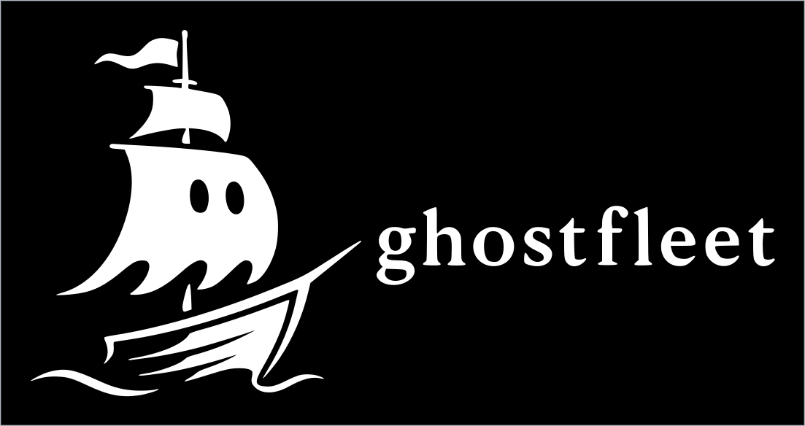
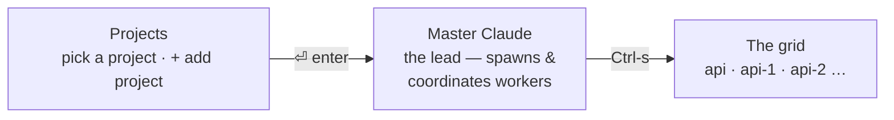

<p align="center">
  
</p>

# ghostfleet

**Run a fleet of Claude Code agents in parallel, from one terminal.** Each agent gets its
own git worktree; you get one screen that shows what every one of them is doing.

<!-- Record with: brew install vhs && vhs demo.tape -->


> A *ghost fleet* is a fleet of autonomous, unmanned vessels under one command — agents
> working with nobody in the seat, and one control plane steering them.

## Why another one of these

Orchestrating agents is easy to demo and hard to trust. The parts that took real
debugging — and that most wrappers get wrong:

| problem | what ghostfleet does |
| --- | --- |
| "is it working?" — the transcript's mtime says idle mid-generation, and busy when a background write lands | reads the live pane, the same signal you read |
| a worker needs you, you handle it, the card stays red forever | a `need-you` older than the session's own activity is treated as spent |
| every project has a session called `master`, so their statuses collide | status is scoped by the fleet's socket, not by name |
| a dispatched prompt silently lands in the input box without submitting | dispatch waits for the paste, submits, then verifies a turn actually started |
| one account: 5 agents drain the budget 5× faster and all stall together | a non-Claude governor meters usage and parks workers at the ceiling, resuming on reset (it can't be the lead — the lead stalls too) |
| you already run agents by hand in a dozen panes | `fleet-adopt` finds those conversations and rebuilds them as one fleet |

## Prerequisites

| requirement | why |
| --- | --- |
| `node` (v18+) | the grid is a zero-npm-dependency Node TUI |
| `tmux` | the hidden substrate that keeps sessions alive in the background |
| `jq` | the status/notification hook parses its JSON payload with it |
| macOS, Linux, or **Windows via WSL2** | sessions are tmux servers, and tmux is POSIX-only — see the native-Windows note below |
| `zellij` (optional) | not required, but the included layout gives you one pane that frees `Ctrl-s`/arrows from its own bindings |
| `terminal-notifier` + [AeroSpace](https://github.com/nikitabobko/AeroSpace) (optional, macOS) | for **clickable** notifications that jump straight to the fleet — see [Notifications](#notifications) |

*(Native Windows isn't supported and won't be: sessions are tmux servers, and tmux is
POSIX-only. Under WSL2 it's just Linux and works the same — that path is untested by
me, so file an issue if something bites.)*

## Install

```bash
brew install tmux jq        # macOS — apt/dnf/pacman on Linux
git clone https://github.com/PabloG55/ghostfleet.git
cd ghostfleet
./install.sh
ghostfleet
```

The installer **stages the runtime** — it copies `bin/`, `hooks/`, `mcp/`, `skill/`, and
`layouts/` out of the repo into `~/.local/libexec/ghostfleet` (override with `CLAUDE_FLEET_HOME`)
— then symlinks the commands (`ghostfleet`, `claude-here`, `cf-sync`, and the `fleet-*` helpers)
into `~/.local/bin` **pointing at the staged copy**; wires the status + notification hooks into
every Claude config dir it finds (`~/.claude`, `~/.claude-*`, backing each up); **registers the
fleet MCP server** into each config dir's `.claude.json` via `claude mcp add -s user` (Claude Code
reads MCP from `.claude.json`/`.mcp.json`, *not* `settings.json`); installs the
`ghostfleet-orchestrate` skill; and links the zellij layout. Re-run any time; it's idempotent.

<details>
<summary>Why the runtime is staged out of the repo (macOS TCC)</summary>

macOS guards `~/Documents`, `~/Desktop`, and `~/Downloads` with **TCC**. An app that hasn't been
granted *Documents folder* / *Full Disk Access* — notably **ClaudeCode.app** — gets
`Operation not permitted` when it tries to **execute** anything stored there. So if you cloned this
repo under `~/Documents`, running the fleet CLI, the event hook, or the MCP server *directly from
the repo* breaks the instant such an app hosts your session (symlinks don't help — exec follows them
back into the protected folder). `~/.local` is **not** TCC-protected, so the installer runs
everything from the staged copy there and the repo stays purely for development.

**After you edit the repo, run `cf-sync`** to push those edits into the live runtime (it copies the
runtime dirs from the recorded source repo into `~/.local/libexec/ghostfleet`; the PATH symlinks,
hook, and MCP already point there, so no re-link is needed). The alternative — granting ClaudeCode.app
Full Disk Access — also works but can reset on app/OS updates; staging survives updates.

</details>

## The three screens

One terminal window (or one zellij pane) — `ghostfleet` is the whole control plane:



`` ` `` (backtick) always steps back one level, from anywhere — grid → master → Projects.

- **Projects** — pick a project and `⏎` drops you straight into its **Master Claude**. Each
  project has its own hidden tmux server (`cf-<project>`) holding its sessions.
- **Master Claude** — the lead session that spawns worktrees and coordinates workers.
- **The grid** — a card per Claude session (status · branch · last message), plus a card for
  every worktree that has **no** live session yet. Every session keeps running in the
  background, so agents work in parallel while you jump between them.

```bash
zellij --layout fleet attach -c fleet    # one zellij session runs everything
# or just run `ghostfleet` in any pane
```

What makes it different: it runs *beside* your setup instead of taking it over. Sessions live on
per-project tmux servers ghostfleet manages for you, so you never lose a session by closing a
window — and if you use zellij, it stays a single pane instead of commandeering your multiplexer
(Claude Squad, ccmanager) or pushing you to a web dashboard (Omnara).

## Everyday shortcuts

The handful of keys that cover almost everything you'll do — switching projects, entering a
worktree, creating a new one. Everything else (scheduling, cycling, per-session settings) is a
nice-to-have documented in **[docs/SHORTCUTS.md](docs/SHORTCUTS.md)**.

`` ` `` (backtick) is the universal **back** everywhere below — it steps out one level, mirroring
detach. `q` does the same on the grid. **Projects** is the root: fully exiting to the shell takes
**`Ctrl-C` twice** (a single stray key can't drop the whole control plane).

### Projects — pick what to work on

| key | does |
| --- | --- |
| `↑↓←→` / `hjkl` | move |
| `⏎` | open that project's **Master Claude** |
| `Ctrl-s` | skip master, go **straight to that project's grid** |
| `+ add project` → `⏎` | browse to a root folder that holds your checkouts/worktrees |
| `x` | remove a project from the list (sessions + history untouched) |
| digit `1`-`9` | jump straight to the project at that position |

### The grid — switching between worktrees, creating a new one

| key | does |
| --- | --- |
| `↑↓←→` / `hjkl` | move |
| `⏎` | enter the selected card full-screen |
| a **`· FREE`** card (grey) | a worktree with no live session — `⏎` attaches directly, no prompt |
| `n` | new session on a checkout — lands on a **naming screen** (edit or accept the suggested name), then resumes if that checkout already has a conversation |
| `N` | same, but the conversation is **forced blank** |
| `x` | kill the session (asks `y`/`Y` to confirm) |
| `q` / `` ` `` | back to master |
| digit `1`-`9` | jump straight to the card at that position |

For an **isolated worker on its own branch** (rather than just another session on an existing
checkout), use `fleet-spawn` — see [Orchestrate](#orchestrate-a-lead-session-driving-workers) below.

### Inside a session

`Ctrl-a` then `g` (mnemonic **g**rid) detaches back a level — or `Ctrl-a d`. From **master**,
`Ctrl-s` (or `Ctrl-a s`) opens the session grid instead. The session keeps running.
(`Ctrl-a` is the tmux prefix; press it twice to send a literal `Ctrl-a` to Claude.)

## Orchestrate: a lead session driving workers

Because every session lives on the same tmux socket, a "lead"/**master** session can dispatch
work to siblings, watch them, unblock them, and manage cost — turning a fleet into
lead-and-workers (e.g. an `api` lead handing briefs to `api-1` / `api-2` worktrees). All of it
is callable from a session's Bash (or the `fleet_*` MCP tools).

**The lead's loop — look before you act.** Fleet state lives on disk (worktrees + a manifest of
what each was spun up for), not in the lead's head, so it *reads* the state instead of guessing —
which is what keeps a long-running or restarted lead from getting lost:

1. **`fleet-worktrees`** + **`fleet-inbox`** — what exists / what's free, and who needs you.
2. **Reuse a free worktree** before creating one — `fleet-spawn` refuses to proliferate (it lists
   the free ones) unless you `--reuse <wt>` or `--new`.
3. **`fleet-answer`** to unblock a stuck worker; **`fleet-pause`** to shed cost.

| goal | command |
|------|---------|
| every worktree + which are **FREE** | `fleet-worktrees` |
| live sessions + status | `fleet-list` |
| who needs you / what **finished** (drains since last look) | `fleet-inbox` |
| dispatch a self-contained brief | `fleet-send <session> "…"` |
| read a worker's last N messages | `fleet-read <session> [n]` |
| **reuse** a free worktree for a worker | `fleet-spawn <name> --reuse <wt> --prompt "…"` |
| **recycle** a worktree onto a fresh branch | `fleet-spawn <name> --reuse <wt> --branch <new> --from main` |
| new worktree (only if none free) | `fleet-spawn <name> [--branch b] [--from ref] --new --prompt "…"` |
| unblock a worker stuck on a dialog | `fleet-answer <session> "2"` |
| park / resume a worker (cost) | `fleet-pause <session>` · `fleet-resume <session>` |
| **rename** a worker + move its worktree | `fleet-rename <session> <new-name>` |
| **stop** a worker for good (or a dead orphan) | `fleet-stop <session>` |

```bash
fleet-worktrees                 # → "Free to reuse: api-3"
fleet-inbox                     # → api-1 DONE (feat/x) · api-2 NEEDS YOU: run tests?
fleet-answer api-2 "2"          # unblock the one waiting on a dialog
fleet-spawn fix-auth --reuse api-3 --branch feat/auth --from main \
  --prompt "Fix token refresh in src/auth/*. Done when auth tests pass."
fleet-read fix-auth 3           # check progress
```

The **inbox carries completion too**: a worker's turn ending shows as `DONE`, so
you learn when a brief is ready to review/merge without polling — and with
`CLAUDE_FLEET_NOTIFY_LEAD=1` the lead is **woken** on `done`/`need-you` (debounced)
so it acts hands-off instead of polling at all (see [Config](#config)). A fresh worktree
gets the main checkout's `node_modules` symlinked in (workers can run
lint/typecheck/tests; opt out with `CLAUDE_FLEET_LINK_NM=0`), and `--from` bases a
branch on your **local** ref — falling back to the remote tip only when local is
*behind* — so a worker never misses just-committed, unpushed work.

These are also exposed as **MCP tools** (`fleet_list` / `_send` / `_read` / `_spawn` /
`_worktrees` / `_inbox` / `_answer` / `_pause` / `_resume` / `_rename` / `_stop`) via a
dependency-free stdio server (`mcp/fleet-mcp.mjs`) that `install.sh` registers in each config dir.
The installed **`ghostfleet-orchestrate` skill** teaches a lead the loop above — reuse before
spawn, pull the inbox instead of polling every sibling, unblock with `fleet-answer`, mind the
shared budget — so you can just say *"work on a worktree to fix X"* and it reuses a free one. Each
session knows its fleet via `CLAUDE_FLEET_SOCK`; prompts must be self-contained (siblings don't
share your context); only sessions in the *same* fleet are reachable.

**Budget.** One account funds the whole fleet, so wide fan-out drains it N× faster and everyone
stalls at the ceiling together. A **governor** (a dumb non-Claude loop, auto-started per fleet)
parks the newest workers as usage nears the ceiling and resumes them when the window resets; those
events show up in `fleet-inbox`. Opt out with `CLAUDE_FLEET_GOVERNOR=off`, watch-only with `=dry`.

## How it works

- **One tmux server per project** (`tmux -L cf-<project>`) is the hidden substrate. It keeps each
  Claude session alive in the background and handles attach / detach / resize — the battle-tested
  part. You never interact with tmux directly.
- **`ghostfleet`** is a tiny loop: it runs the grid, and when you pick a card it hands off to
  `tmux attach`. Detach and the loop redraws the grid. Node never owns PTYs.
- **`fleet-grid.mjs`** is a flicker-free Node TUI (zero npm deps). Each card joins three sources:
  the tmux session list, the per-session status file that the Claude hooks write to
  `~/.claude/fleet/`, and the last assistant line from the transcript in `~/.claude/projects/`.
  Worktrees with no live session are read straight from `git worktree list`.
- **`claude-here`** is what each session runs, so sessions resume by checkout. If a
  conversation was registered as a Claude Code **background agent** (e.g. it was
  backgrounded, or created by a bg workflow), a plain `--resume` is refused with
  "currently running as a background agent" — so `claude-here` detects that (via
  `claude agents --json`) and resumes with `--fork-session`, branching an
  interactive copy with full history. The fork becomes the newest conversation, so
  the next open resumes it cleanly.

Status per card: `● NEEDS YOU` (permission/question) · `◆ working` · `✓ ready` · `· idle` ·
`· FREE` (worktree, no session).

## Config

`ghostfleet` sets these per project; each spawned session inherits them (used by the grid, hooks,
and `fleet-*` tools):

| Env var               | Meaning                                                          |
| --------------------- | --------------------------------------------------------------- |
| `CLAUDE_FLEET_SCOPE`  | The project name (shown in the header; scopes checkout discovery).|
| `CLAUDE_FLEET_ROOT`   | The project's root folder (where its checkouts/worktrees live).  |
| `CLAUDE_FLEET_SOCK`   | The project's tmux socket, `cf-<project>`.                       |
| `CLAUDE_CONFIG_DIR`   | The account/config dir for the project's `profile`.              |
| `CLAUDE_FLEET_DIR`    | Per-session status files (`$CLAUDE_CONFIG_DIR/fleet`).           |
| `CLAUDE_FLEET_YOLO`   | `0` to require permission prompts in sessions (default: bypass). |
| `CLAUDE_FLEET_AWAKE`  | `display` to keep the screen on as well as the machine; `off` to inhibit nothing. Default `on`. See [Staying awake](#staying-awake). |
| `CLAUDE_FLEET_NOTIFY_LEAD` | `1` to **push** worker `done`/`need-you` events to the lead instead of it polling. See [docs/SHORTCUTS.md](docs/SHORTCUTS.md) for the per-project/per-session settings-page toggle and the full precedence rules. |

`ghostfleet <project> --plain` prints a one-shot, non-interactive table for that project (scripts).

---

## Advanced & special cases

Everything below is real, but you'll reach for it far less often than what's above — multi-account
setups, migrating an existing scattered workflow, notification tuning, and the mechanics behind a
couple of conveniences.

### Already running Claude by hand? Adopt it

If you already work the scattered way — a Claude session per terminal tab or zellij
pane, spread across a repo and its worktrees — you don't have to start over.
`fleet-adopt` finds those conversations, registers the project, and reopens each one as
a card on that project's fleet, with a single master over them.

```bash
fleet-adopt ~/acme                 # DRY RUN: shows what it would adopt
fleet-adopt ~/acme --go --start    # adopt them + start the master
```

```
fleet-adopt · /Users/you/acme · profile work · fleet cf-acme · DRY RUN
  175944ef   ~/acme/api              Want me to pull that request row + audit…
  0621074a   ~/acme/acme-1           I killed the stale processes and relaunc…
  6fff3551   ~/acme/acme-2           Confirmed — that commit belongs to a sep…
  8 conversation(s) -> cards on cf-acme, one master over them
```

Options: `--days N` how far back to look (default 30), `--per-dir N` conversations per
checkout (default 1 = the newest), `--profile P`, `--start`, `--go`.

It **reopens** conversations — a running process can't be moved between terminals. You
don't have to go closing panes yourself, though: adopt detects which conversations are
open right now (a live Claude carries its conversation id in its own argv) and handles
them rather than silently duplicating:

- **default** — those rows are skipped, naming the pid holding each one
- `--takeover` — quits that Claude for you (the same as typing `/exit`), then adopts it
- `--force` — adopt anyway, accepting two live copies (rarely what you want)

```bash
fleet-adopt ~/acme --go --takeover --start   # adopt everything, closing panes for me
```

To register a project without adopting anything (the CLI form of "+ add project", and
what a lead session uses via the `fleet_project_add` tool):

```bash
fleet-project add ~/code/newapp --start   # register it and boot its master
fleet-project list
```

### Cycling sessions with Shift-arrows

`Shift-→` / `Shift-←` step along the project's ring — **master first, then the workers in the
same order the grid numbers them**, wrapping at both ends:

```
master  ⇄  worker 1  ⇄  worker 2  ⇄  …  ⇄  back to master
```

It's instant: both sessions live on the same tmux server, so the client just switches and nothing
redraws — no detach, no grid, the control plane never wakes up. (`Ctrl-f`'s jump chord still has
to go the long way round, because it crosses *projects*, and those are separate tmux servers a
client can't switch between.) Backing out with `` ` `` respects where you actually **ended up**,
not where you started: cycle master → worker and `` ` `` drops you at the grid, not at Projects.

**Shift** rather than Ctrl on purpose: every no-prefix binding is stolen from the app, so the only
question is what you can afford to lose. `Ctrl-←/→` is word-jump in Claude's input and you'd miss
it; `Shift-←/→` does nothing in a Claude session, tmux only spends it in the prefix table, and
zellij's arrow bindings are all `Alt-`. `Ctrl-a ←` / `Ctrl-a →` work too, prefixed.

### Scheduling a message

`s` on a grid card — or on a **project** card, which targets that project's `master`: type a time
and it sends a message into that session then — great for resuming when your usage limit resets.
Examples: `3:50am`, `15:30`, `+2h`. Message defaults to `continue`; customize with
`<time> | <message>`. A scheduled card shows `@3:50a`. Under the hood a detached waiter runs
`tmux send-keys` at that time, holding the machine awake for the wait.

*Caveat:* fires only if the machine is awake then — for a closed-lid guarantee also run
`sudo pmset schedule wake "MM/dd/yy HH:mm:ss"`.

### Staying awake

Running `ghostfleet` holds an *idle sleep off* assertion for as long as the control plane is up
(`caffeinate -i -s` on macOS, `systemd-inhibit` on Linux — see `bin/fleet-awake`). A sleeping box
freezes every worker mid-turn and eats scheduled sends, and leaves nothing behind to say why.

By default the **screen still goes dark** on its own timer (macOS `displaysleep`, 5 min on
battery) while the machine stays fully awake. That is indistinguishable from a slept machine at a
glance, so a working fleet can read as a broken one — check it, don't guess:

```bash
fleet-awake --status
# holding sleep for pid 27809 (bash) — inhibitor pid 27817
# kernel: PreventUserIdleSystemSleep=1 PreventUserIdleDisplaySleep=0
```

Set `CLAUDE_FLEET_AWAKE=display` to pin the screen on too, at the cost of the backlight. A
**closed lid still sleeps** either way — the `pmset schedule wake` line above is the only hard
guarantee across one. `CLAUDE_FLEET_AWAKE=off` inhibits nothing.

### Notifications

Notifications post via **`osascript`** by default — reliable on modern macOS since it goes through a
system app that's already authorized to post. When a session needs you or finishes, you get a
named notification (checkout · branch).

**Optional click-to-jump.** Set `CLAUDE_FLEET_NOTIFIER=terminal-notifier` to use
[terminal-notifier](https://github.com/julienXX/terminal-notifier) instead, which makes notifications
**clickable**: a click runs `fleet-jump` → focuses your fleet window ([AeroSpace](https://github.com/nikitabobko/AeroSpace),
matched by window title) and lands you on **master**, so you coordinate through the lead. Caveat:
macOS must *authorize* terminal-notifier (System Settings → Notifications), and its Homebrew build
often ships with a broken signature — re-sign it once:
`codesign --force --deep -s - "$(brew --prefix)"/Cellar/terminal-notifier/*/terminal-notifier.app`.
If a window is ever mis-matched, pin it in `~/.config/ghostfleet/windows`
(`<zellij-session> <aerospace-window-id>` per line).

### Profiles (work vs personal accounts)

Claude Code keeps each account in its own config dir (`CLAUDE_CONFIG_DIR`) — that dir holds
the login, `settings.json`, `projects/` (transcripts) and the fleet's `fleet/` status. A project's
`profile` (3rd column in the projects file; default `work` = `~/.claude`, `personal` =
`~/.claude-personal`) picks its account, so work and personal never mix:

```
# ~/.config/ghostfleet/projects   (name <TAB> path <TAB> profile)
web	~/code/web	work
api	~/code/api	work
sideproj	~/projects/sideproj	personal
```

Each project's sessions live on their own socket under that account's config dir, so accounts never
mix. Work keeps the bare `cf-<project>`; every other profile is namespaced `cf-<profile>-<project>`,
so the same project name in two profiles can't collide.

<details>
<summary>Two ways to split, and which you want</summary>

The table above is the *mixed* list: one Projects screen showing work and personal side by side.
The other way gives each profile its **own** projects list, so the screen only ever shows one side:

```bash
ghostfleet            # work      -> ~/.config/ghostfleet/projects           + ~/.claude
ghostfleet personal   # personal  -> ~/.config/ghostfleet/projects.personal  + ~/.claude-personal
ghostfleet <anything> # any name works: projects.<name> + ~/.claude-<name>
```

Use the **mixed list** if you want everything on one screen and only the account to differ. Use
**`ghostfleet <profile>`** if you want work and personal genuinely separate — different project
lists, different account, different sockets. The two can coexist; a row's 3rd column always wins,
so a row marked `work` inside `projects.personal` really does run on `~/.claude`.

</details>

<details>
<summary>Setting up the second account</summary>

The config dir holds the login, so a new profile starts logged out. **Log in before installing**,
because `install.sh` only wires hooks and MCP into `~/.claude-*` dirs that already look like config
dirs — an empty one is skipped, and you'd get a profile whose sessions never report status:

```bash
CLAUDE_CONFIG_DIR=~/.claude-personal claude    # then /login with the other account
./install.sh                                   # NOW it sees the dir and wires it up
ghostfleet personal                            # empty picker -> "+ add project"
```

Re-run `./install.sh` any time you add a profile; it's idempotent and backs up each `settings.json`.

</details>

<details>
<summary>The one sharp edge</summary>

`ghostfleet <name>` checks the **work** list first and jumps into that project if the name matches.
Anything else is read as a *profile* — so the `ghostfleet <project>` shortcut (and `--plain`) only
ever reaches **work** projects. A personal project's name is not a jump target:

```console
$ ghostfleet sideproj
ghostfleet: no profile "sideproj"
  (looked for /Users/you/.config/ghostfleet/projects.sideproj)

  "sideproj" is a PROJECT in the "personal" profile, not a profile.
  Open it from that profile's screen:  ghostfleet personal

  known profiles:  work personal
  new profile:     ghostfleet sideproj --new
```

(`--new` is how you'd deliberately create a *third* profile — see below.)

An unknown profile is **refused, not created** — a typo and a personal project name used to both
land you at an identical blank picker with a phantom `projects.<typo>` left behind, which told you
nothing about which mistake you'd made. Creating a profile is now the explicit `--new`:

```bash
ghostfleet client --new   # writes ~/.config/ghostfleet/projects.client, then opens it
```

</details>

### Extras

- `scripts/enable-zellij-resume.sh` — optional: make hand-started `claude` panes resurrect as
  `claude --continue` on zellij re-attach.

### Uninstall

In each config dir (`~/.claude`, `~/.claude-*`): remove the fleet `hooks` blocks and the
`ghostfleet` entry under `mcpServers` from `settings.json` (or restore a `settings.json.bak.*`),
and delete `skills/ghostfleet-orchestrate`. Then delete the symlinks in `~/.local/bin`, and
`tmux -L cf-<project> kill-server` for any live fleets.

## License

MIT © 2026 Pablo Garces
