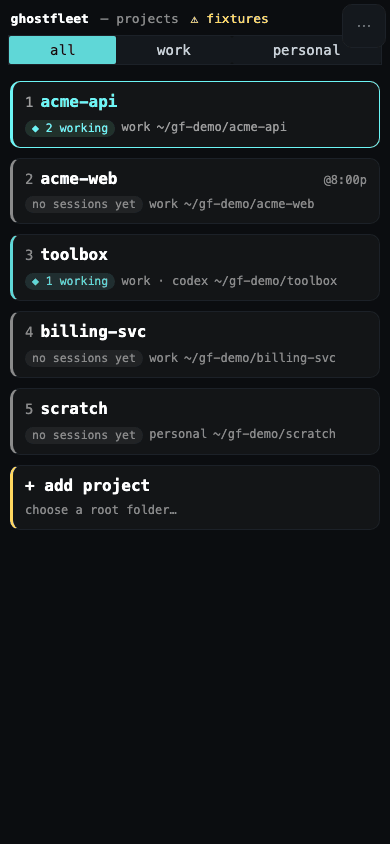
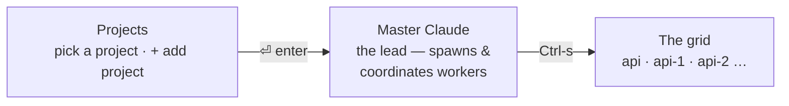

<p align="center">
  
</p>

**Run a fleet of Claude Code agents in parallel, from one terminal.** Each agent gets its
own git worktree; you get one screen that shows what every one of them is doing.

> A *ghost fleet* is a fleet of autonomous, unmanned vessels under one command — agents
> working with nobody in the seat, and one control plane steering them.

<p align="center">
  
</p>
<p align="center">
  <b>Start a worker.</b> <sub><code>w</code> cuts a worktree, branches it, picks which agent
  runs it, and boots it — you land in the session.</sub>
</p>

<p align="center">
  
</p>
<p align="center">
  <b>Watch three at once.</b> <sub><code>claude</code>, <code>opencode</code> and
  <code>codex</code> side by side — every pane live and typable, across projects.</sub>
</p>

<p align="center">
  
</p>
<p align="center">
  <b>Unblock one from anywhere.</b> <sub>The same grid as an installable web app. A session is
  a chat; its <code>pane</code> tab is the real terminal, so a worker stuck on a permission
  prompt gets an answer from your pocket.</sub>
</p>

<p align="center">
  <sub>All three recorded against a real fleet by <a href="worktree.tape"><code>worktree.tape</code></a>
  and <a href="stack.tape"><code>stack.tape</code></a>. Details:
  <a href="docs/SHORTCUTS.md">keys</a> ·
  <a href="docs/stack-view.md">the stack</a> ·
  <a href="web/README.md">the phone client</a>.</sub>
</p>

## Why another one of these

Orchestrating agents is easy to demo and hard to trust. The parts that took real
debugging — and that most wrappers get wrong:

| problem | what ghostfleet does |
| --- | --- |
| "is it working?" — the transcript's mtime says idle mid-generation, and busy when a background write lands | reads the live pane, the same signal you read |
| a worker needs you, you handle it, the card stays red forever | a `need-you` older than the session's own activity is treated as spent |
| every project has a session called `master`, so their statuses collide | status is scoped by the fleet's socket, not by name |
| a dispatched prompt silently lands in the input box without submitting | dispatch waits for the paste, submits, then verifies a turn actually started |
| one account: 5 agents drain the budget 5× faster and all stall together | a non-Claude governor meters usage and parks workers at the ceiling, resuming on reset (it can't be the lead — the lead stalls too) |
| you already run agents by hand in a dozen panes | `fleet-adopt` finds those conversations and rebuilds them as one fleet |

## Documentation

The README is the pitch, the install and the shape of the thing. Everything you look up
*while using it* lives in `docs/`, one file per question, because three reference sections
had grown to 78% of this page and a README is not where you go to check a keystroke.

| | |
| --- | --- |
| **[docs/SHORTCUTS.md](docs/SHORTCUTS.md)** | **Every key, and what answers it.** Start at §0 — the handful that covers almost everything — then the exhaustive sections: inside a session, the Projects screen, the grid, the stack, the `fleet-*` commands, and the behaviors that are not guessable from the UI |
| **[docs/ORCHESTRATION.md](docs/ORCHESTRATION.md)** | **A lead session driving workers.** Dispatching briefs to siblings, watching them, unblocking them, reusing worktrees before making more, and metering cost with the governor |
| **[docs/OPERATIONS.md](docs/OPERATIONS.md)** | **The special cases.** Adopting Claude sessions you started by hand, the phone client, notifications, work-vs-personal profiles, staying awake, where a worktree goes, and updating Claude Code under a live fleet |
| **[docs/mobile.md](docs/mobile.md)** · **[web/README.md](web/README.md)** | The phone client — the design argument, and the client itself |
| **[docs/stack-view.md](docs/stack-view.md)** | Why the stack is nested attaches and not `join-pane`, and what was measured to find out |
| **[docs/multi-agent-sessions.md](docs/multi-agent-sessions.md)** | Running `codex` and `opencode` workers beside `claude`, and what degrades |
| **[docs/ROADMAP.md](docs/ROADMAP.md)** · **[docs/IDEAS.md](docs/IDEAS.md)** | What is next, and what is only an idea |
| **[CLAUDE.md](CLAUDE.md)** | For working *on* ghostfleet: how to deploy a change, what the tests cover, and the failure modes that have bitten more than once |

## Prerequisites

| requirement | why |
| --- | --- |
| `git` | worktrees **are** the isolation model — a worker is a checkout on its own branch. `fleet-spawn` refuses to run without it |
| `claude` ([Claude Code](https://github.com/anthropics/claude-code)) | what a session runs by default, and what the pane detectors are written against |
| `node` (v18+) | the grid is a zero-npm-dependency Node TUI |
| `tmux` | the hidden substrate that keeps sessions alive in the background — missing? the installer offers to install it for you (see below). With no terminal attached it has nobody to ask, so a piped or CI install prints the command instead — pass `--yes` there and it installs without prompting |
| `jq` | the installer wires the hooks and MCP entries with it, and the status hook parses its payload with it. **macOS 26 already ships it** (`/usr/bin/jq`); anywhere it is missing the installer offers to install it |
| macOS, Linux, or **Windows via WSL2** | sessions are tmux servers, and tmux is POSIX-only — see the native-Windows note below |
| `codex` / `opencode` (optional) | alternative agents, chosen per worktree on the `w` form. Their pane signals are detected separately — see [docs/multi-agent-sessions.md](docs/multi-agent-sessions.md) |
| `$EDITOR` (optional, default `nvim .`) | what `Ctrl-n`'s editor tab opens. Any editor works — override with `CLAUDE_FLEET_EDITOR`. No particular Neovim distribution is involved; if `nvim` isn't installed, set the variable to what you use |
| `tailscale` (optional) | **only** for the phone client, and only off-LAN: it is how `fleet-serve` is reachable without exposing a port — see [docs/mobile.md](docs/mobile.md) |
| `zellij` (optional) | not required, but the included layout gives you one pane that frees `Ctrl-s`/arrows from its own bindings |
| `terminal-notifier` + [AeroSpace](https://github.com/nikitabobko/AeroSpace) (optional, macOS) | for **clickable** notifications that jump straight to the fleet — see [Notifications](docs/OPERATIONS.md#notifications) |

*(Native Windows isn't supported and won't be: sessions are tmux servers, and tmux is
POSIX-only. Under WSL2 it's just Linux and works the same — that path is untested by
me, so file an issue if something bites.)*

## Install

```bash
npx ghostfleet-cli          # installs, no clone needed
ghostfleet
```

Prefer to clone the repo (e.g. to develop against it)?

```bash
git clone https://github.com/PabloG55/ghostfleet.git
cd ghostfleet
./install.sh
```

Both run the same `install.sh` — `npx ghostfleet-cli` just fetches the package and runs it
for you, so nothing is left checked out afterwards. The command it installs is
`ghostfleet`, not `ghostfleet-cli`: the npm package name and the binary name are separate,
and only the package name had to change.

**The package is `ghostfleet-cli`, and `ghostfleet` on npm is someone else's.**
`ghostfleet@0.0.2` was published by an unrelated project ten days after this one took the
name, pitched as "fleets of disposable AI agents in your own cloud" — close enough that
`npx ghostfleet` looks right and installs a stranger's package. Nothing here can be done
about that, so the suffix is load-bearing: type `-cli`.

Cloning is also what you want if you intend to edit ghostfleet itself: `cf-sync` syncs the
runtime **from a real repo**, and an npx cache is not one.

**If you already have a clone, be careful running the npx installer over it.** `install.sh`
records where to sync FROM in `<runtime>/.source`, and `cf-sync` with no argument reads it —
so an installer run from an npx cache used to repoint that at the cache, after which every
`cf-sync` in your clone copied the *cache* into the live runtime. Nothing errors and the sync
still prints `synced runtime`; your edits just quietly stop arriving. The installer now
**keeps a recorded clone** when it is running from a cache (it says so: `pointer stays on your
clone: …`), so this only bites an older install. To fix one, do either:

```bash
cd /path/to/ghostfleet && ./install.sh    # re-install from the clone — it re-records it
cf-sync /path/to/ghostfleet               # or just repoint it once; later `cf-sync` remembers
```

Check it any time with `cat ~/.local/libexec/ghostfleet/.source`. An install run *from* a
clone always repoints — that includes a re-install from the same clone, a moved clone, and a
second clone — because the guard only fires when the copy being installed from could not serve
as a sync source at all.

Missing `tmux`? The installer detects it, works out the right package manager for your
OS (Homebrew, apt, dnf, yum, pacman, zypper, or apk), and asks before running anything
— it never installs (or `sudo`s) without you confirming. No package manager recognized,
or you say no? It just tells you the command to run yourself.

**Installing with no terminal (CI, a Dockerfile, `curl | bash`)?** There is nobody to ask,
so the default is to install nothing and print the command — and `tmux` is not optional
here: a fleet session **is** a tmux server, so an install that skipped it leaves a grid
that cannot start anything. Consent up front instead:

```bash
npx ghostfleet-cli --yes          # or: ./install.sh --yes, or CLAUDE_FLEET_YES=1
```

That installs the missing dependencies without prompting, using the same package manager
it would have offered — `sudo` included on Linux, which is why it is opt-in and never the
default. With `--yes`, an install that ends without `tmux` **exits non-zero** instead of
looking successful. Without it, nothing is installed unless you say yes at the terminal.

**With `npx`, the flag goes *after* the package name.** `--yes` (and `-y`) is npx's own
flag too, so `npx --yes ghostfleet-cli` is consumed by npm and this installer is invoked
with no arguments at all — it then refuses exactly as if you had never passed it
(measured on npm 11.18; it notices and says where the flag belongs, but the install still
skips `tmux`). In a Dockerfile or a CI config, the env var is the form nothing can
misparse:

```dockerfile
ENV CLAUDE_FLEET_YES=1
RUN npx ghostfleet-cli
```

The installer **stages the runtime** — it copies `bin/`, `hooks/`, `mcp/`, `skill/`, and
`layouts/` out of the repo into `~/.local/libexec/ghostfleet` (override with `CLAUDE_FLEET_HOME`)
— then symlinks the commands (`ghostfleet`, `claude-here`, `cf-sync`, and the `fleet-*` helpers)
into `~/.local/bin` **pointing at the staged copy**; wires the status + notification hooks into
every Claude config dir it finds (`~/.claude`, `~/.claude-*`, backing each up), plus a `PreToolUse`
guard that stops Claude Code's built-in `EnterWorktree` from walking a fleet session off its own
checkout (it is *appended* to `PreToolUse`, so hooks you already have there survive); **registers the
fleet MCP server** into each config dir's `.claude.json` via `claude mcp add -s user` (Claude Code
reads MCP from `.claude.json`/`.mcp.json`, *not* `settings.json`); installs the
`ghostfleet-orchestrate` skill; and links the zellij layout. Re-run any time; it's idempotent.

<details>
<summary>Why the runtime is staged out of the repo (macOS TCC)</summary>

macOS guards `~/Documents`, `~/Desktop`, and `~/Downloads` with **TCC**. An app that hasn't been
granted *Documents folder* / *Full Disk Access* — notably **ClaudeCode.app** — gets
`Operation not permitted` when it tries to **execute** anything stored there. So if you cloned this
repo under `~/Documents`, running the fleet CLI, the event hook, or the MCP server *directly from
the repo* breaks the instant such an app hosts your session (symlinks don't help — exec follows them
back into the protected folder). `~/.local` is **not** TCC-protected, so the installer runs
everything from the staged copy there and the repo stays purely for development.

**After you edit the repo, run `cf-sync`** to push those edits into the live runtime (it copies the
runtime dirs from the recorded source repo into `~/.local/libexec/ghostfleet`; the PATH symlinks,
hook, and MCP already point there, so no re-link is needed). The alternative — granting ClaudeCode.app
Full Disk Access — also works but can reset on app/OS updates; staging survives updates.

</details>

## The screens

One terminal window (or one zellij pane) — `ghostfleet` is the whole control plane:



`` ` `` (backtick) always steps back exactly one level, from anywhere — session → grid → master
→ Projects — no matter which shortcut you took *down*.

- **Projects** — pick a project and `⏎` drops you straight into its **Master Claude**. Each
  project has its own hidden tmux server (`cf-<project>`) holding its sessions.
- **Master Claude** — the lead session that spawns worktrees and coordinates workers.
- **The grid** — a card per Claude session (status · branch · last message), plus a card for
  every worktree that has **no** live session yet. Every session keeps running in the
  background, so agents work in parallel while you jump between them.
- **The stack** (`t` from the grid) — several of those sessions on screen *at the same time*, in
  split panes, including sessions from different projects.

```bash
zellij --layout fleet attach -c fleet    # one zellij session runs everything
# or just run `ghostfleet` in any pane
```

What makes it different: it runs *beside* your setup instead of taking it over. Sessions live on
per-project tmux servers ghostfleet manages for you, so you never lose a session by closing a
window — and if you use zellij, it stays a single pane instead of commandeering your multiplexer
(Claude Squad, ccmanager) or pushing you to a web dashboard (Omnara).

## How it works

- **One tmux server per project** (`tmux -L cf-<project>`) is the hidden substrate. It keeps each
  Claude session alive in the background and handles attach / detach / resize — the battle-tested
  part. You never interact with tmux directly.
- **`ghostfleet`** is a tiny loop: it runs the grid, and when you pick a card it hands off to
  `tmux attach`. Detach and the loop redraws the grid. Node never owns PTYs.
- **`fleet-grid.mjs`** is a flicker-free Node TUI (zero npm deps). Each card joins three sources:
  the tmux session list, the per-session status file that the Claude hooks write to
  `~/.claude/fleet/`, and the last assistant line from the transcript in `~/.claude/projects/`.
  Worktrees with no live session are read straight from `git worktree list`. Card order is its
  own fourth source (`<sock>.order`, rewritten by `⇧hjkl`) — and the single one, since
  `ghostfleet` counts `Ctrl-f <p> <s>` through `fleet-grid.mjs --order` rather than re-deriving
  it, and `fleet-cycle` reads the copy mirrored onto the tmux server as `@cf_order`.
- **`claude-here`** is what each session runs, so sessions resume by checkout. If a
  conversation was registered as a Claude Code **background agent** (e.g. it was
  backgrounded, or created by a bg workflow), a plain `--resume` is refused with
  "currently running as a background agent" — so `claude-here` detects that (via
  `claude agents --json`) and resumes with `--fork-session`, branching an
  interactive copy with full history. The fork becomes the newest conversation, so
  the next open resumes it cleanly.

Status per card: `● NEEDS YOU` (permission/question) · `◆ working` · `✓ ready` · `· idle` ·
`· FREE` (worktree, no session).

## Config

`ghostfleet` sets these per project; each spawned session inherits them (used by the grid, hooks,
and `fleet-*` tools):

| Env var               | Meaning                                                          |
| --------------------- | --------------------------------------------------------------- |
| `CLAUDE_FLEET_SCOPE`  | The project name (shown in the header; scopes checkout discovery).|
| `CLAUDE_FLEET_ROOT`   | The project's root folder (where its checkouts/worktrees live).  |
| `CLAUDE_FLEET_SOCK`   | The project's tmux socket, `cf-<project>`.                       |
| `CLAUDE_CONFIG_DIR`   | The account/config dir for the project's `profile`.              |
| `CLAUDE_FLEET_DIR`    | Per-session status files (`$CLAUDE_CONFIG_DIR/fleet`).           |
| `CLAUDE_FLEET_YOLO`   | `0` to require permission prompts in sessions (default: bypass). |
| `CLAUDE_FLEET_AWAKE`  | `display` to keep the screen on as well as the machine; `off` to inhibit nothing. Default `on`. See [Staying awake](docs/OPERATIONS.md#staying-awake). |
| `CLAUDE_FLEET_NOTIFY_LEAD` | `1` to **push** worker `done`/`need-you` events to the lead instead of it polling. See [docs/SHORTCUTS.md](docs/SHORTCUTS.md) for the per-project/per-session settings-page toggle and the full precedence rules. |

`ghostfleet <project> --plain` prints a one-shot, non-interactive table for that project (scripts).

---

## Uninstall

In each config dir (`~/.claude`, `~/.claude-*`): remove the fleet `hooks` blocks and the
`ghostfleet` entry under `mcpServers` from `settings.json` (or restore a `settings.json.bak.*`),
and delete `skills/ghostfleet-orchestrate`. Then delete the symlinks in `~/.local/bin`, and
`tmux -L cf-<project> kill-server` for any live fleets.

## License

MIT © 2026 Pablo Garces
