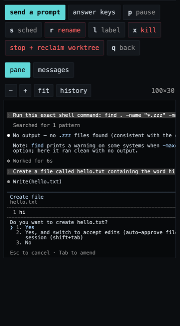
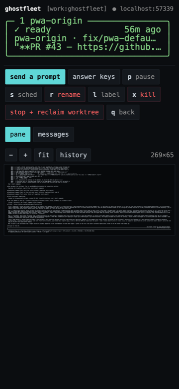

# Mobile: the fleet from a phone

**Status:** design settled; `--json` (§4) shipped in #41, `fleet-serve` and the client in
flight. Three decisions are settled: the transport is Tailscale with Tailnet Lock (§5),
the phone gets the **full verb set** rather than a read-only phase (§7), and content is
served **unredacted** (§11.3). **Three** things in here were **wrong until they met
a user**, and one of them twice: §7's session screen was a message list and could not show
a command, then it was a pane behind ten buttons and is now a chat with the pane one tap
away (§7a, which keeps both corrections and says why the second does not undo the first);
§4 left `master` out of the cards, so the phone could reach every worker and not the
session you send work to ("it's not opening the main agent, just the sessions" — §4's
`lead`); and nothing was on the history stack, so the system back gesture left the app
instead of walking back through it (§10).
Every number below was measured on this machine before the design was written, and **two
of the measurements changed the design** — the sleep setting (§8) and the dependency
posture (§6). See those sections before disagreeing with the conclusions.

The fleet is invisible away from the desk. A worker that needs a permission at 9pm waits
until someone opens a terminal, and the thing you actually want to know from a couch or a
café — *is anything blocked on me* — costs a laptop. This is the design for **running**
the fleet from a phone: the same grid, the same cards, the same verbs, including creating
and reclaiming worktrees.

## 1. The constraint everything else follows from

**The endpoint is remote code execution, by design.** Not incidentally, not if it has a
bug — that is its purpose:

- `fleet_spawn` runs shell commands and creates checkouts.
- `fleet_send` injects prompts into agents running `--dangerously-skip-permissions`.

Anyone who reaches this service runs code as the user. And the data is not incidental
either: the grid's own `LAST MSG` column renders conversation text, and fleet transcripts
contain `DATABASE_URL` for hosted Neon, Clerk keys, and — on a fleet working a production
codebase — customer records belonging to real people.

So the security posture is not "add a login page." It is: **the service is never publicly
routable, and every mutating call is authenticated, confirmed and recorded.** Everything
in §5–§7 follows from that sentence, and a change that weakens it is a redesign, not a
tweak.

Note what is deliberately *not* the mitigation: reducing what the phone can do. Parity is
a requirement (§7), so the capability is fixed and the controls are identity,
confirmation and accountability instead.

## 2. What already exists (and why this is smaller than it looks)

Two thirds of this is built.

**The data.** `fleet-grid.mjs --plain` already computes every field the phone needs:

```
$ node bin/fleet-grid.mjs cf-acme-api tmux/cf.tmux.conf --plain
0 need you · 2 working · 4 ready
TAB         CHECKOUT      BRANCH                    AGENT    STATUS     LAST MSG                                      IDLE
api-fix     api-fix       feat/retry-backoff        claude   working    All three cases covered. Running the full s…  busy 41s
docs-pass   docs-pass     docs/openapi-examples     opencode ready      Done. Draft PR #212 — the drift was two sch…  50m ago
```

And it is fast enough that polling is not a design problem:

```
busiest fleet (6 live sessions)             0.39s
all 14 projects                             0.17s   (most are empty and exit immediately)
```

**The actions.** `mcp/fleet-mcp.mjs` is already the complete verb set — list, send, read,
spawn, worktrees, inbox, answer, pause, resume, stop, rename, project_add, projects — and
already `project`-aware, so one client can drive every fleet. Since #38 it validates its
own required arguments and refuses a call rather than shelling out with `"undefined"`,
which is exactly the property you want before putting it behind a network.

**What is missing** is a machine-readable output, a transport, and a client.

## 3. Architecture

```
   phone (PWA, home screen)
        │  HTTPS
        │  over Tailscale — never the public internet (§5)
        ▼
   fleet-serve            ── reads ──►  fleet-grid.mjs --json
   (node, on the Mac)                    fleet-read --json
                                         tmux capture-pane -p -e   (§7a)
                          ── acts ──►   MCP dispatch (same handlers, same guards)
                          ── holds ──►  caffeinate (§8)
```

One new daemon, one new flag, one static client. No new logic: `fleet-serve` is a
transport over code that already exists, and that is deliberate — a second implementation
of "what is this session doing" would drift from the grid's, and the grid's is the one
with the scars.

## 4. `fleet-grid.mjs --json`

`--plain` is formatted for a TTY: the last message clips at 44 columns, and a value that
fills its column touches the next one (`adapter-pro…adapter-probe`). The *values* are already
computed by `cardLines()` — they are truncated on the way out. `--json` emits them whole.

The schema is deliberately **exactly what `cardLines()` consumes** — with two deliberate
additions, both noted under the block — so the phone renders from the same inputs the TUI
does and the two cannot disagree. The values below are `web/fixtures/grid-acme-api.json`:
two of its eight cards, plus one `free_worktrees` row from `grid-free.json`, since
`acme-api` has no free worktree. `test/helpers/doc-fixtures.mjs` holds them to that.

```jsonc
{
  "project": "acme-api",
  "profile": "work",
  "counts": { "need_you": 0, "working": 2, "ready": 5,   // the lead is counted, see below
              "parked": 0, "limit": 0, "interrupted": 0 },
  "cards": [
    {
      "name":      "master",              // THE LEAD, and always the first card
      "label":     null,
      "status":    "ready",
      "folder":    "acme-api",            // the main checkout — the repo itself
      "branch":    "main",
      "agent":     "claude",
      "pr":        null,                  // PR number for `branch`, as a string; null = unknown
      "msg":       "Dispatched the retry work to api-fix. Waiting on its PR.",
      "age":       95,
      "attached":  true,
      "sched":     null,
      "limit_at":  null,
      "lead":      true                   // not a worker: no stop, no reclaim, no rename
    },
    {
      "name":      "api-fix",             // what fleet-send/fleet-read address
      "label":     null,                  // titles the card when set; name moves to line 2
      "status":    "working",             // the nine-value vocabulary, verbatim
      "folder":    "api-fix",             // the worktree it sits in
      "branch":    "feat/retry-backoff",
      "agent":     "claude",              // rendered only when != claude
      "pr":        "1184",                // string, not a number: an identifier, never arithmetic.
                                          // null means "could not tell" — no gh, no network, no
                                          // PR and a cold cache all land there, and the card
                                          // then draws exactly as it did before the field
      "msg":       "All three cases covered. Running the full suite before I touch the migration.",
      "age":       41,                    // seconds; null when unknown
      "attached":  false,
      "sched":     null,                  // { "at": <epoch>, "msg": "…" } → card shows @HH:MM
      "limit_at":  null,                  // "10:20pm" → card shows ↻ 10:20pm
      "lead":      false                  // on every card, never omitted
    }
  ],
  "free_worktrees": [
    { "path": "/Users/pgarces/gf-demo/toolbox-3", "branch": "feat/x", "task": "rework the CSV column mapper",
      "removing": false }                // true while `git worktree remove` is still running
  ]
}
```

### `lead`: the card the TUI does not have

**`master` is in `cards`, first, and marked.** It was not, and that is the bug this
section was amended for — from the person using the app, after a week of real use: *"it's
not opening the main agent, just the sessions."* `gather()` had always filtered master out
of the grid, and `--json` inherited the filter.

**That filter is right for the TUI and wrong for a remote client**, and the distinction is
the whole of the fix. The grid is drawn from *inside* master: you are already in it, a card
for yourself would be redundant, `q` returns you there, and the header would count you
among the workers you are deciding about. A phone is inside nothing — it is a viewer of
every session — so for it master is not "here", it is simply unreachable. Same producer,
one argument (`gather({lead: true})`), two card lists; `--plain`, `--order` and the TUI are
byte-for-byte what they were.

- **First, not last.** The stack picker had already made this call for the same reason
  (`sessionStatuses`: the lead, then that project's card order) — and it has to be
  *outside* `applyOrder`, because `<sock>.order` is written from the TUI's own cards and so
  has never held master. Merged in, the lead would land at the END on every fleet that has
  ever been reordered. It is also just true that the lead is the card you opened the app to
  find. **The fleet's numbering is untouched:** `--order` still excludes it, so
  `Ctrl-f <p> <s>` and ⇧←→ at the desk count the same sessions they always did. The digit
  on a phone card is that card's own position, which is what `grid.js` already documents.
- **`lead` is a boolean on every card**, and the client must not re-derive it by comparing
  the string `"master"`. The producer decides it once; a client that compared the name
  would do it in the card list, on the session screen and beside each destructive button —
  three copies to keep in step, in front of the one verb that deletes work. `fleet-worktrees`
  already calls this row `LEAD`.
- **It counts.** `counts` is a fold over `cards` and nothing else — the only definition
  that cannot drift, since `web/grid.js`'s `countsFrom()` folds the same array in the
  client and the suite asserts the two agree on every fixture. It is also the right answer
  to the question §1 says this exists to ask: a lead sitting on a permission prompt is the
  most important `need_you` on the fleet, and "0 need you" over it would be the summary
  lying at exactly the glance you would act on. The TUI's header counts no lead because the
  TUI's cards contain none — one rule, two card lists.
- **`removing` on a free worktree** is true while a grid is deleting that checkout —
  `git worktree remove` on a big one takes the better part of a minute, so it is a state and
  not an instant. The TUI paints those cards `⋯ REMOVING` and refuses a second removal of
  the same one. The phone does not render it yet and shows such a worktree as free, which is
  the one place this wire format is currently ahead of the client.
- **`+ new session` and the FREE worktree cards are untouched.** `free_worktrees` already
  excluded the main checkout ("that's master's slot, never a free card"), so the lead
  arriving as a card takes nothing away from that list and adds nothing to it.
- **The Projects screen counts it, and that is a convergence rather than a change of
  mind.** `/api/projects` rolls each project up from these same cards, so a project's
  `total` gains one and a blocked lead turns its project card red — which is §1's whole
  question. The desk has always worked this way: `projectStatus` reads `sessionStatuses`,
  whose comment says *"Includes master: it's the project's lead session"*. So the phone was
  the surface under-counting, and the two now agree. The seam is asserted as an identity
  (the rollup's total *is* the card count `/api/grid` served for the same project, from the
  same daemon), because until then the rollup was only ever tested against a stub grid
  while the cards were only ever tested through the real emitter, and nothing crossed the
  join.

**And the lead cannot be stopped, reclaimed, renamed or parked — enforced server-side.**
`bin/fleet-stop` and `bin/fleet-rename` already refused by name, but they refuse in the
*shell*, and a nonzero exit from a `bin/fleet-*` command is deliberately not treated as a
refusal (several of them write to stderr on success). So `fleet_stop --reclaim master`
came back through `fleet-serve` as `ok: true` with the words *"refusing to stop 'master'"*
in the success toast, and the audit logged `result: 'ran'`. The refusal moved into
`plan()` in `mcp/fleet-dispatch.mjs` — the one layer both callers go through — so the MCP
server returns an `isError` and the daemon a 400 with `result: 'refused'`. The client not
drawing the button is the affordance, never the control (§7).

`fleet_pause` is refused for the same reason and on the same authority: `bin/fleet-governor`
already excludes master from the sessions it parks — *"master is never parked"* — because a
fleet whose lead is off drains no inbox and dispatches nothing, and the way out was
flipping a marker by hand. It only became reachable at all when the lead gained a card, and
there it is **swipe-left on the first card**.

**`fleet_resume` is deliberately NOT refused.** The recovery direction has to stay open, or
a lead parked by an older build could never be turned back on from the one surface that can
see it. Both halves of that asymmetry are asserted, in both callers — an untested asymmetry
is one the next reader tidies into symmetry.

`sched` carries the scheduled **prompt** as well as the time, and that is the other place
this schema is not simply what the card draws. `@10:30pm` with no way to say *what* will
be sent is half a fact: in the TUI you are one keystroke from the session and can go and
look, and on a phone you are not, so the text is the difference between a card that
informs and a card that raises a question it cannot answer. It is emitted **whole** —
a user-authored prompt of arbitrary length, the only such field here — because clipping
it in the emitter would be a display decision taken in the wrong layer, and §11.3 already
settled that content is served unredacted and bounded only for transport cost. The client
clips, exactly as it does for `msg`. The marker on disk also holds the `pid` of the
process that will send it; that is deliberately **not** on the wire, because it names a
process on one machine and means nothing to a client that is not on it.

Three rules this schema has to keep, each of which the TUI already keeps and each of
which is a way the summary could lie:

1. **`status` carries all nine values** — `need-you`, `working`, `ready`, `parked`,
   `idle`, `starting`, `unknown`, `limit`, `interrupted`. Do not collapse them client-side.
2. **`unknown` is not `idle`.** It means the agent's adapter has no validated busy
   detector and we genuinely cannot tell. Rendering a confident green dot it has not
   earned is the exact failure the status layer exists to prevent.
3. **`limit` is never folded into `ready`.** Five workers at a usage ceiling rendered as
   "5 ready" is the summary line lying at a glance, which is the one place it must not.

`--json` is additive. `--plain`, `--order` and the TUI are untouched — including the card
list: theirs has no lead in it, and `counts` follows whichever list it is folding.

## 5. Transport: reachable from anywhere, routable from nowhere

These are separable properties and the design depends on separating them.

**Recommended: Tailscale.** A WireGuard mesh — it works from cellular, a hotel, anywhere,
while the Mac has **zero inbound open ports**. Device-level keys, MFA through the identity
provider, MagicDNS for a stable name, and a lost phone is revoked from the admin console
in seconds. It fails *closed*: a misconfiguration makes the service unreachable, not
public.

**Explicitly not Tailscale Funnel.** That is the feature that publishes to the internet.

**Acceptable alternative: Cloudflare Tunnel + Cloudflare Access.** `cloudflared` is
already installed on this machine (another project's dev-stack skill uses it). Outbound-only,
no open ports, and Access adds SSO, policy and audit logs. Choose it if a real URL is
wanted. The tradeoff is honest: the hostname *is* publicly routable and all the security
lives in the Access policy being right, so it fails *open*.

**Rejected: quick tunnels.** `cloudflared tunnel --url` and `ngrok http` — both installed
here — publish to the open internet behind a random hostname. That is security by
obscurity, and scanners enumerate those hostnames. For an endpoint that spawns processes
it is not a tradeoff, it is a breach with a delay.

### Who can join the tailnet at all

The ACL question and the enrolment question are different, and only the second one
survives a compromised Tailscale account — an attacker with the account enrols their own
node and never touches the PWA.

**Tailnet Lock** closes that. With it on, a new node needs a cryptographic signature from
one of *your* existing trusted nodes, and peers reject an unsigned key, so **neither a
compromised account nor a compromised Tailscale coordination server can add a device**.
Available on the Personal plan.

It has a real failure mode that has to be handled at setup, not later: enabling it issues
**ten disablement secrets, once**. Lose those *and* the signing nodes and the tailnet
cannot be recovered — not by support, unless a secret was deposited with them in advance.
So designate both the Mac and the phone as signing nodes (two is the minimum anyway) and
store the secrets somewhere that survives losing both devices.

**A tag-based ACL** then narrows what an enrolled device may reach. The default tailnet
policy is `src: * → dst: *:*` — every device reaches every other — so a future work
laptop silently gets the fleet unless this is written:

```json
{ "action": "accept",
  "src": ["tag:fleet-client"],
  "dst": ["tag:fleet-server:8787"] }
```

Tags, not node IDs: a node ID changes on reinstall, and an ACL pinned to a stale one
either breaks confusingly or — if `*` gets pasted in while debugging — widens silently.

### Auth on top of the transport

The VPN authenticates a **device**, not a person; an unlocked phone on the tailnet is
inside. So the service also requires:

- **A passkey at every open.** Face ID on cold start and after the app has been
  backgrounded for a few minutes. Not a password: a password typed twenty times a day
  converges on something short, autofills from a manager on the very unlocked phone that
  is the threat, and is replayable. A passkey is bound to the secure enclave, cannot be
  copied off the device, and does not degrade with use.
- **Server-enforced, not client-enforced.** The passkey assertion mints a short-lived
  session token (~15 min) and the API rejects any request without a live one. A lock
  screen that only gates the UI is decoration — `curl` with the bearer token would walk
  straight past it.
- **A bearer token** identifying the enrolled client, device-bound and individually
  revocable.
- **A second passkey assertion on the destructive verbs** (§7).
- **Bind to the tailnet interface only**, never `0.0.0.0`, so a bug in the VPN layer does
  not immediately become a bug in this one.
- **An append-only audit log** of every request that changes anything, surfaced as a
  `fleet-inbox` row (§12).
- **Rate limiting**, because a token that leaks should be slow to exploit.

The layers answer different questions, which is why all of them are here: Tailnet Lock —
*can this device join*; the ACL — *may it reach this port*; the passkey — *is this the
owner*; the session token — *is that still true right now*.

## 6. Client: a PWA, and the reason is the repo

The client is a **Progressive Web App**, served by `fleet-serve`, installed to the home
screen. React Native was considered and rejected — the deciding argument is not developer
preference, it is what this repository is:

```
$ cat package.json | grep -c dependencies      0
$ ls node_modules                               (does not exist)
$ grep -ahoE "^import .* from '[^n.]" bin/*.mjs mcp/*.mjs
                                                (no output — node builtins only)
```

ghostfleet is a **zero-dependency npm package** on node ≥18 builtins: 5 shell scripts, 4
`.mjs`, 2 tmux configs. A PWA keeps that — one HTML file and one JS file served by a
process that already exists. React Native brings `node_modules`, a build step, EAS and a
native toolchain into a package whose whole pitch is `npx ghostfleet`.

Two supporting reasons: the UI is a **monospace card grid**, which is native to HTML and
something RN's flexbox would fight to reproduce; and updates are instant, which matters
for a tool that will be iterated on daily. The Apple Developer account is available, so
distribution cost is *not* part of this argument.

**Note on Expo Go**, since it was raised: it is a development sandbox, not a distribution
channel. Shipping installed requires EAS Build plus TestFlight. Running permanently inside
Expo Go against a dev server is possible for personal use but needs Expo Go open and the
dev server up, and cannot do reliable background push — the worst combination for a thing
you glance at from a café.

**If push reliability proves to be the blocker, RN becomes correct and the migration is
cheap**, because the server API does not change. That is a reason to specify §4 well, not
a reason to build RN now.

### The layout is the grid

Not a new design. `renderGrid()` computes its card columns from width — `const nc =
cols()` — so **a phone is `nc = 1`**. The card is the same five lines `cardLines()`
produces:

```
╭─ 2 api-fix ──────────────────╮
│ ◆ working           busy 41s │   status · age (or ↻ reset, or @scheduled)
│ api-fix · feat/retry… #1184  │   worktree · branch  (+ agent when != claude, then the PR)
│ "All three cases covered. R… │   last message
╰──────────────────────────────╯
```

The `+ new session` card and the grey `FREE` worktree cards carry over unchanged, because
they are already cards. Screens map one to one: Projects → grid → session. Keys map to
touch: `1-9`/`⏎` → tap, `⇧hjkl` → drag to reorder, `p`/`P` → swipe, `x` → long-press with
the same `y = yes` confirmation.

**The stack has no phone equivalent** and does not need one. It exists to put four
sessions side by side; a phone has no side, and at `nc = 1` that is just the card list.

The one screen that is **not** a mirror of a TUI screen is the session screen, because the
TUI has no such screen: `⏎` on a card *attaches to the pane*. §7a is what that means on a
phone, and getting it wrong was the first thing a user noticed.

### Text size, rotation, and the keyboard

Three things about the viewport that were each reported from a phone and each measured
before they were changed.

**The chrome does not scale with the reader's text.** iOS Dynamic Type takes body text to
about 53px at its largest accessibility size, and every control in the session bar had been
sized in `em`. Measured at 320px with the body at 30px: `.who` and the mode chip had both
already shrunk to **zero** and the row still needed 406px, of which `chat|pane` alone was
231. A row wider than the phone makes the body scrollable sideways, and once the page is
scrolled *every* screen shows a clipped right edge — which is why the send button reading
`senc` and the ⋯ hanging off the edge were one bug and not three.
So a name is content and scales; a back chevron, a view switch and a ⋯ are affordances and
are sized in px, because what they need to be is tappable rather than proportional. Rows
wrap as a last resort, buttons truncate rather than leave the screen, and `overflow-x: clip`
on `html, body` is the backstop that turns "the whole app slid" into "one label is short".
The rule this file has stated since #48 — one region scrolls, the page never moves sideways
— is a rule the stylesheet keeps now rather than one somebody has to remember.

**Rotation is unlocked, and that is only safe because the grid grew columns.** The manifest
no longer pins portrait. On its own that gives a tablet one card stretched across a
landscape viewport, which is worse than the lock — so `.cards` is a grid whose track
minimum is one card wide (`min(33ch, 100%)`, the card plus the gutter the TUI leaves, capped
so a phone's single column can never be wider than the phone). A wider viewport gets *more
cards*, which is exactly what `cols()` does at the desk. Measured across the three font
sizes `fitCards()` lands on: phones are **1 column at every size**, an iPad portrait 2–3, an
iPad Pro landscape 3–6. `font-size: var(--fs)` on `.cards` is load-bearing — `ch` resolves
against the element's own font, and measuring it at `body`'s size while the art is drawn at
`--fs` laid a 269px card into a 265px column.
*Not verified:* whether iOS honours `orientation` for a standalone PWA at all. It has
historically ignored it and no desktop browser can answer the question. If it still does,
nothing regresses — the tablet stays portrait with fewer columns.

**And the software keyboard is left alone, after one attempt at handling it.** This is worth
reading before anybody tries again.

The problem is real: on iOS the keyboard is not part of the dynamic viewport, so `100dvh`
does not shrink when it opens, and Safari's own move is to **pan the page** to bring the
focused composer into view. The attempted fix drove the shell column's height from
`visualViewport.height` and called `scrollTo(0, 0)` from visualViewport's `scroll` handler to
undo that pan. On a real iPhone it produced the opposite of the intent — the composer pinned
to the **top** of the screen over the status bar, the transcript black beneath it — because
a `scrollTo` inside a scroll handler is a fight for the scrollbar that the page loses, and
because visualViewport's `height` and `offsetTop` do not reliably revert when the keyboard
closes, so geometry derived from them is left misaligned. That is a documented property of
the API, not a bug in the attempt.

It is `dvh` again and Safari pans as it likes: a pan that ends is survivable where a layout
that never recovers is not. The one piece kept is the bottom safe-area inset collapsing while
the keyboard is up — that is a *padding* rather than a geometry, so its worst case is 34px
wrong for a moment. `interactive-widget=resizes-content` would be the clean answer and Safari
does not implement it.

**Why the suite was green through all of it**, which is the part with the lesson in it. The
harness fakes visualViewport to the shape iOS presents — layout viewport unchanged, visual
viewport short by a keyboard — and *that much is faithful*. What no desktop engine does is
**respond** the way Safari does: it does not pan, and it does not leave those values
unreverted. So the rows asserted the client's reaction to a fake and read that as the feature
working. `the composer sits above the keyboard` was measurably true in Chrome and false in a
hand. It is deleted rather than weakened, with a comment saying not to add it back: whether
the composer is comfortably reachable above a real keyboard is a **device** question, and no
amount of headless measurement can stand in for it.

## 7. Full parity, and where the guardrails actually live

**The phone gets the whole verb set, including `spawn` and `stop --reclaim`.** A
read-only first phase was proposed and rejected: an app that reports a worker has been
blocked on "Allow `pnpm test`?" since 9pm and cannot answer it has not solved the problem
that motivated it, it has only described it more conveniently.

That decision does not lower the bar from §1, it moves where the bar is enforced. If
capability is fixed at parity, security stops being about *restricting what can be done*
and becomes about *proving who is doing it, and leaving a record*:

- **Passkey / WebAuthn re-auth on the destructive verbs** — `spawn`, `stop --reclaim`,
  `rename`, `kill`. Not a block; a biometric prompt at the moment of action, so a phone in
  someone else's hand is not the same as a phone plus its owner. **This makes the phone
  stricter than the terminal**, which cannot ask for a fingerprint.
- **The TUI's own confirmations, reproduced.** The grid already guards these, and
  inheriting them *is* parity rather than an addition:

  ```
  kill session 'api-fix'?                y = yes · any other key = cancel
  remove worktree 'toolbox-3' (feat/x)?  y = yes · any other key = cancel
                                         f = remove anyway
  ```

  A phone confirmation is a second deliberate tap, and `--force` needs its own.
- **Every mutating call writes an audit row**, and that row surfaces as a `fleet-inbox`
  entry (§12). A log nobody reads is a compliance gesture; a log that appears in the grid
  is a control.
- **Rate limiting**, so a leaked token is slow to use.

Enforcement is **server-side on the tool name**, never on which buttons the client draws.
A client-side restriction is a suggestion.

### The two things that cannot transfer

Physical constraints, not policy:

- **The stack** (§6) — it exists to put sessions side by side, and a phone has no side.
- **`Ctrl-t` terminal and `Ctrl-n` editor tabs** — these open a shell and neovim in the
  session's folder. There is no local shell on the phone to open them in. Streaming a
  remote shell is a much larger surface than the rest of this document combined and is
  deliberately out of scope; the fleet verbs cover what those tabs are usually reached
  for.

  **§7a does not reopen this, and the difference is the whole reason it is safe.** The pane
  view is a periodic `capture-pane` — a photograph of a grid tmux already laid out, one
  direction, no pty, no session of its own, nothing the phone can type into except the
  verbs that were already server-side and audited. A terminal tab is an interactive shell:
  a pty, a live byte stream both ways, and arbitrary command execution outside the verb
  vocabulary §7 enumerates. Reading a pane and owning a shell are not the same surface, and
  "we already show a terminal" is not an argument for the second.

### The one place the phone shows LESS, and why the numbers did not move

**Profile tabs on the Projects screen** — `all`, then one per profile — are a control the
TUI does not have. Everything else here is the desk's screen at `nc = 1`; this is the
phone deciding what to draw. It earns that because a phone is a glance and a fleet is not
one list: *"add like tabs on the projects page to differentiate between work and
personal."* `all` is the default and hiding nothing is the first run, because §1's
question is *is anything blocked on me* and that must not need two looks — which is also
why a tab carries its own `need you` count when it has one. A tab that hid a blocked
project silently would be the summary lying at exactly the glance you would act on.

**The number on a card is an address, and it stays global.** `Ctrl-f <p>` resolves through
`proj_nth()` in `bin/ghostfleet`, which counts **every** non-comment line of
`~/.config/ghostfleet/projects` — no profile filter anywhere on that path, and
`fleet-grid`'s `pBuild()` and `fleet-serve`'s `/api/projects` are equally unfiltered. So
the phone's merged list has always agreed with the desk, and it goes on agreeing: filter
the array and number the result, and `scratch` would be card 1 in the personal tab while
`Ctrl-f 1` opens `acme-api`. **The tab decides what is drawn, never what a card is
called** — a digit that sends someone to the wrong project is worse than no digit.

Two consequences worth stating, because both look like bugs until you know: a digit key
still opens the project with that number even when the tab is not showing it (it is an
address, not a position on screen), and a drag inside a tab moves a project past the
neighbours it is hiding, so one press is one *visible* step. The alternative — a single
step that swaps with a card you cannot see — reads as the gesture doing nothing.

Everything else maps: `n` new · `w` worktree · `s` schedule · `p`/`P` pause and resume ·
`x` kill or remove · `,` settings · `⇧hjkl` reorder · `Ctrl-f` jump · `Ctrl-p`/`Q`
projects · `q` back.

## 7a. The session screen: a chat, with the pane one tap away

**This section has been wrong twice, both times for the same reason — it was written before
anyone had lived with it — and the two corrections point in opposite directions. Read them
in order, because the second does not undo the first.**

### Correction 2 (current): it is a chat

*"can we literally convert it to a normal chat like the Claude app... now it look weird it
has a bunch of buttons and the chat is very small, also let's see if we can add smth to
reproduce the last message like an audio... it's not that responsive either, the screen
moves around."*

Four complaints, four different causes, and only one of them was styling:

- **"a bunch of buttons and the chat is very small."** The session screen was a header, a
  card, **ten** footer buttons, a view switch and *then* the content. On a 390×844 phone
  that is over half the screen spent before the first message. The verbs are one `⋯` sheet
  now; nothing was dropped and the lead's refusals are still absent from it.
- **"a normal chat."** The transcript was a table — newest-first, every row stamped
  `HH:MM · role`. It is bubbles now, oldest at the top, opened at the bottom, with a
  **composer** instead of `send a prompt` opening a full-screen form to type one line.
  Two roles, two sides. This is the one part of the client that is deliberately *not* a
  transcription of the TUI; the cards still are, and `grid-parity` still holds them to it.
- **"the screen moves around."** Structural, not cosmetic. The whole app was a single
  scrolling *document* that `render()` wipes and rebuilds every poll — 5s for the grid, 2s
  for the pane — so nothing owned the scroll position and every repaint dropped the reader
  wherever the browser landed. Worse, the pane's box was sized by *measuring* the space
  left under a button bar that rewraps, so the layout moved when the buttons did. There is
  now a shell: the page itself never scrolls, and the one region that does is a flex child
  that owns its own `scrollTop` (the idiom the pane already had, applied to the chat).
  `sizePaneBox`'s measurement is dead under it — flex is given the height, so measuring it
  was standing in for a layout that could not answer the question.
- **"reproduce the last message like an audio."** `SpeechSynthesis`, in the browser
  already: no network call, nothing for the CSP to refuse, no service to keep alive. One
  button, in the composer, reading the newest assistant turn — a speaker on every bubble is
  the button wall again. **What is spoken is not what is written:** fenced code becomes the
  words "code block" (you cannot follow code by ear, and pretending otherwise costs a
  minute of listening), inline code loses its backticks, links become "link", and it is
  capped at 1200 characters because there is no way to skim a voice. It is a stop toggle,
  because two voices at once is the failure mode of a play button.

**And the default view flipped, which is the part that had to be paid for rather than
argued away.** Correction 1 below moved it to the pane for a reason that is still true: a
permission dialog is drawn by the agent *into its pane* and is not in `/api/session`'s
payload at all, so **a chat cannot show one**. So a blocked session says so *in the chat* —
a red banner naming exactly that, with one button to the pane, where the answer is typed.
The chat is the better place to read a conversation; the pane is the only place to unblock
one; the banner is the seam, rather than something to find out.

Two things came free with the layout, both pre-existing and both invisible while that
screen was small: `save()` had never persisted `session`, so quitting from a session and
reopening restored the session *screen* with nothing on it (`'null' is not on this fleet's
grid any more`) — it now persists the session and **clamps**, because you cannot be on a
screen whose subject is missing. And a restored screen **seeds the history trail**, or the
first back-gesture out of it leaves the app.

### Correction 1: the pane, and why it is still here

*"it doesn't look like a normal chat and i can't see the commands that is running — is it
possible to make it look exactly as the computer version?"*

Both halves were true and they had one cause. The session screen rendered `/api/session`,
which goes through `fleet-read --json` and emits `{ts, role, text}` — assistant and user
**prose**. A tool call, the command inside it and its result are not in that payload at
all. So the screen was not under-rendering the commands; it never had them, and no amount
of client work could have produced them.

And "exactly as the computer version" has a precise answer, because at the desk `⏎` on a
card **attaches to the tmux pane**: you get the Claude Code TUI — `⏺` bullets,
`⎿ Bash(…)` tool headers, the spinner, the elapsed counter, the permission dialog. That is
the thing being asked for, and this repo already has the rule for how to get it. CLAUDE.md,
about every status detector here: **the pane is the truth.** Reconstructions drift; that is
why nothing in this codebase infers what a session is doing from anything but its pane.

So: **`GET /api/pane` returns `tmux -L <sock> capture-pane -p -e -t <session>`**, and the
client renders the escapes. A real permission dialog, on a real 390pt viewport — the `⏺`
bullet, the `Write(hello.txt)` tool header, the diff, the numbered choices, and `answer
keys` sitting above it:



```
GET /api/pane?project=<name>&session=<name>[&scrollback=0..2000]
 -> { ok, project, session, scrollback, at, pane: "<text with SGR escapes>" }
```

`-e` is the whole point — it keeps the SGR escapes, and colour and attributes are how the
TUI distinguishes a tool header from prose. Without it you get grey text that technically
contains the commands and reads like a log file. Scoped by the fleet's **socket** and
targeted as a bare `-t <name>`, exactly as every other reader in this repo is, and for the
reasons both are already written down: every project has a session called `master`, and a
session name can be tmux target syntax (`bin/fleet-tab`).

No geometry from tmux in that payload, though `display-message -p '#{pane_width}'` would
answer directly. That would be a **second** resolution of the same target, free to
disagree with the capture beside it — so the client counts rows and columns from the bytes
it was actually sent, which cannot.

### It does not attach, and it does not resize

`capture-pane` reads. **Attaching** is what would make the daemon a tmux *client*, and a
client sizes the window to fit itself: a phone attaching to a 269-column pane reflows the
agent's window to ~40 columns, and the desktop finds its session cropped. The neighbouring
lesson is already in CLAUDE.md too — *a detector measured at full width can go blind in a
narrow one* — so a phone-shaped pane would not merely look odd at the desk, it would take
the fleet's own status reading with it.

"Just capture it at phone width" is the same mistake wearing a rendering costume. It is a
write to the fleet. The phone is a spectator of the grid the desk laid out.

### Width is the honest problem

The pane was captured at whatever the desktop layout gave it — **269 columns** on this
machine's fleets, measured — and a phone is about 40. Nothing makes that readable at once,
so the design does not pretend otherwise:

- **Never wrapped, never reflowed.** A wrapped TUI is unreadable and is no longer the
  computer version. It scrolls **sideways inside its own box**, and the page body never
  does — a body that scrolls horizontally slides the whole app off the screen, header and
  verbs with it.
- **Both readings are offered.** `fit` scales the whole pane into the viewport to see its
  *shape* — is there a dialog, is a diff on screen, where is the spinner — and `±` takes it
  back to a size you can read and pan across. Font-size rather than a transform, so the
  glyphs re-lay out crisply at every step. All 269 columns at once, which is unreadable and
  is not meant to be read:

  
- **The box takes the screen that is left below it,** measured. A `vh` constant is wrong on
  every phone, because the verb bar above it wraps to however many rows the buttons need —
  and what falls below the fold is the *bottom* of the pane, which is where the prompt, the
  spinner and a dialog's last line live.

### The two rules the cards already paid for

Both are in `web/app.css` for the cards and both matter **more** here, because a pane is
hundreds of columns of exactly the characters that break:

1. **Bold is never `font-weight`.** The bold face has no box-drawing glyphs, so `─ ╭ ╮ ╰ ╯`
   fall back to a wider font while `│` and the letters do not — 366px against 517px on one
   32-character line, measured in Chrome at 19px. SGR 1 is rendered as the **bright half of
   the palette**, which is the other thing bold has always meant on a terminal and the half
   that cannot move a glyph.
2. **One cell per cell.** `⧗` measures 1.274 advances and `⏸` 1.046 in every monospace face
   on this machine, so each non-ASCII code point goes in a box of exactly `1ch` — through
   the same `cells()` the cards use, extended with a `2ch` case for the characters tmux
   lays into two columns. In a card a stray quarter-column cost a right border; in a
   box-drawn permission dialog it is the border walking out of the box.

### Polling

**2s while the pane is on screen, 4s with `history` on, and nothing at all while the page
is hidden.** The timer is *cleared* on `visibilitychange` rather than left to skip its
turns: `if (document.hidden) return` inside the callback still wakes the radio and the JS
thread on schedule to decide it should not have, and a phone doing that every two seconds
in a pocket has already paid the cost this is about.

With the grid poll's 5s that is ~42 reads/min against `serve.json`'s 240/min, about a sixth
of the ceiling. A 269x65 pane captures to 5.9 KB with its escapes, measured, so 2s is
roughly 3 KB/s over the tunnel; `history` quadruples the payload, which is why it halves
the rate rather than keeping it.

### The message list stays

It is reachable on the same screen with one tap, and it is not a consolation prize: it
pages back over the **whole** transcript (§11.3's 20-with-load-more), which a pane cannot —
a pane is what fits on a screen plus whatever scrollback tmux kept. Two views of two
different things, not two attempts at one. What a tap on a *card* lands on is the pane,
because the question a card is tapped to answer is "what is this worker doing right now".

### What this unlocks, which is the actual point

`answer keys` has been on this screen since the phone had one, and it was close to useless:
§7 put it there for the motivating case in §1 — a worker blocked on "Allow `pnpm test`?"
since 9pm — and you could not see what you were answering. With the pane visible the dialog
is legible and the keystroke is obvious. That chain is what makes the app worth opening
from a café, so it is tested as a chain: the pane carries a real permission dialog, the
verb clears it, and the pane afterwards is different. Any one of those alone proves
nothing, because a pane that never changes and a verb that does nothing look identical.

### Playing a message aloud

**Any message, not the newest one.** The control used to live in the composer, and it lived
there only because "the last thing the agent said" was the only speakable thing — which made
*the newest message* the whole feature rather than a default. Tapping a bubble reveals a play
control on that bubble, and tapping another moves it. The count of visible speakers is
exactly what it was, which is one: a speaker on every bubble is the button wall this screen
was rebuilt to get rid of.

A **tap** reveals it and the control plays. Long-press is already `x kill` on a card and
already the text-selection gesture inside a bubble, and a third meaning would be the worst
kind of hidden. A tap that started talking would make scrolling dangerous.

**What is spoken is not what is written**, and the gap is bigger than markdown. Fenced blocks
become the words "code block", inline code loses its backticks, links become "link" — and
identifiers are **named rather than spelled**. A synthesiser reads a 40-character sha one
character at a time: about fifty seconds, for a string nobody could write down from a speaker
anyway, wrapped in a four-word sentence.

The line is not "numbers are noise" — a filter that dropped every digit would be worse than
none. It is **address versus fact**:

| named, not spelled | kept, because it is the sentence |
|---|---|
| shas → *a commit* · UUIDs → *an id* | counts and results — `1885 passed`, `0 failed` |
| ISO timestamps → *a timestamp* | PR and issue numbers — `#1171` |
| `0x…` → *a hex id* · `\x1f` → *an escape code* | versions — `2.1.241`, `v0.147.0` |
| paths → their basename, plus `line 86` | percentages, durations, sizes — `40%`, `6s`, `5.9 KB` |

A path keeps its basename because that is usually what the sentence is about, and its line
number because that is one short word by ear and the difference between a bug *in that file*
and a bug *at that spot*. `feat/retry-backoff` and `@anthropic-ai/claude-code` survive whole:
a dotted last segment is what separates a path from something that merely contains a slash.

**A voice picker and a rate** sit in settings, and the list reports how many voices it
actually got — a picker that silently offers one entry looks broken in the same way an empty
one does. The button is a **drawn icon** rather than an emoji: one horn plus a swapped
decoration, the viewBox, the stroke width and the horn each written once so the two states
cannot drift into different weights. The `aria-label` is load-bearing rather than a nicety —
an icon contributes no text, so without it a screen reader says "button" and nothing else,
which is strictly worse than the emoji it replaced.

### The thinking indicator

> *"can we add a `...` animation while it is working?"*

Between the transcript echoing your prompt and the answer landing, this screen used to draw
nothing. The optimistic bubble covers the first few seconds and then clears itself, and from
there the wait is indistinguishable from a send that went nowhere — on the one screen whose
whole job is saying what is actually happening.

Three dots on an agent-side bubble at the end of the transcript, for exactly as long as the
card says `working`. **The status is the one the 5s poll already delivers** and the grid card
already shows: no new signal, no new endpoint, and nothing for two sources to disagree about.

It is not a message, and each of those is asserted rather than assumed: it is not built by
`turn()`, so it is never spoken and never gets a play control; it is not in `S.sess.messages`,
so it cannot become "the last thing the agent said"; and the card's preview line is computed
on the server, so it cannot leak there either. A reader parked mid-conversation stays parked
across it arriving **and** leaving — a node appearing and disappearing at the end of a
scroller is exactly the height change §7a's scroll memory exists to survive.
`prefers-reduced-motion` gets a static ellipsis rather than nothing.

### Sending a photo

A camera beside the composer. Pick a photo, and the path it lands at appears **in the box you
are about to send**, where you can see it before you send it — what reaches the agent is an
ordinary prompt that happens to name a file, through the same `fleet_send` every other
message uses.

That is the whole mechanism, and it works because of a measurement rather than a feature:
`fleet-send` pastes **text**, so a photo has to become a file on the Mac and the prompt has to
name its path — and given a path, `claude` and `codex` both read the pixels. `opencode`
depends on its model, which is why the composer says so when you aim one at an opencode
worker. [docs/attachments.md](attachments.md) is the research behind all of it.

**The original bytes go up and the Mac converts them**, which is a deliberate inversion of
the obvious design. Downscaling on the phone means `createImageBitmap`, and every measurement
behind that was taken in Chrome on macOS — while the device this exists for hands out
**HEIC**, and whether Safari decodes a HEIC blob is *still* unmeasured. Converting here with
`sips` makes that answer irrelevant instead of load-bearing. The cost is the request body:
this one route accepts 9 MB where every other accepts 1, and a photo over **6 MB** is refused
with a message that says 6 MB.

**No thumbnail, deliberately.** The CSP is `default-src 'self'`, so a `blob:` in an ``
is refused and the only route is decoding to a canvas — which is the same HEIC question
again. A preview that worked for a JPEG from a laptop and silently showed nothing on the
phone the feature is for would be worse than none. The path in the composer is the
confirmation, and it is the same string the agent is given.

Everything about where the bytes land, what is refused and who deletes them is in
[docs/OPERATIONS.md](OPERATIONS.md); the short version is that filenames are generated here
and never the client's, content is sniffed rather than declared, SVG is refused by name, and
nothing ever serves the bytes back out.

## 8. Availability: the measurement that nearly sinks it

```
$ pmset -g custom
Battery Power:   sleep 1    ttyskeepawake 1
AC Power:        sleep 1    ttyskeepawake 1    womp 1
```

**The Mac is configured to sleep after one minute idle — on AC as well as battery.** The
fleet survives today only because `ttyskeepawake` holds the machine awake while tmux ttys
are active. That is incidental, not designed: quiet ttys or closed windows and the machine
sleeps, and the phone sees nothing with no explanation.

Required before any of this is useful:

```
sudo pmset -c sleep 0          # never sleep on AC
```

plus `fleet-serve` holding a `caffeinate` handle for as long as it runs (already a pattern
in this repo, and already guarded as macOS-only). `womp 1` gives Wake-on-LAN, which is
LAN-only and does not help from a café.

## 9. Push

> **Built, and this section is what it was built against.** Everything below the line was
> written as an argument for NOT doing this, and two of its premises expired: the origin is
> now a real `<name>.ts.net` with a Let's Encrypt certificate — Web Push requires exactly
> that, and a self-signed origin cannot subscribe at all — and the two events worth a buzz
> turned out to be the two the fleet already emits, so the expensive half was already
> built. What did NOT expire is the throttling paragraph, and it is the reason this sends
> **rare, high-value events and nothing else**: two kinds (a session that needs you, a
> session that has an answer), one notification per burst, and nothing at all while the
> phone is being looked at. It is still a bell, not a feed.
>
> Shape, in one paragraph. `bin/fleet-serve.mjs` watches every profile's fleet dir for the
> status transitions the hook already writes (`→ need-you`, `working → ready`), so nothing
> new is emitted anywhere — which is also how the MASTER's own turns are covered, since the
> inbox block in `hooks/fleet-event.sh` deliberately skips them. VAPID is an ES256 JWT and
> the body is RFC 8291 `aes128gcm`; both are `node:crypto`, so the zero-dependency rule
> holds. The payload is `{ v, kind, n, at, sessions?: [{ project, session, kind }] }` —
> there is no field a sentence could live in, which is Pablo's "never transcript text" made
> structural rather than reviewed. Suppression happens on the SERVER, before sending, using
> the poll it just answered: iOS may revoke a subscription whose worker takes a push and
> shows no notification, so the worker is never allowed an opinion. `fleet-serve push
> --detail anonymous` reduces the payload to a count, because his project names are client
> names and a lock screen is readable by whoever is holding the phone.
>
> Native Claude Code push (below) is still worth having and is not replaced by this: it
> fires on the permission prompts inside ONE session, and this says which of thirty
> sessions to open.

iOS Web Push works for home-screen-installed PWAs (16.4+), but it is throttled, the
service worker is killed aggressively, and there is no background fetch while closed. For
"a worker finished," polling on open is fine. For "a worker is blocked on you," it is not.

**Mitigation, using something already shipped:** Claude Code has native mobile push —
`/config` → *Push when actions required* — which fires on permission prompts and
questions. Enabling Remote Control on **masters only** delivers the urgent alert natively
from the Claude app while the PWA remains the map.

This is deliberately not "use Remote Control as the UI," which was considered and
rejected: Remote Control addresses one session at a time by name and has no notion of a
fleet, a grid, or a hierarchy — the things this document exists to put on a phone. It is
being used here as a bell, not as a screen.

Worth noting the addressing already lines up: since #35 every fleet session is named
`<project>/<session>`, which is exactly the name Remote Control connects by, so a session
card can deep-link into the Claude app for the conversation surface without ghostfleet
building a chat client.

## 10. What this does not do

- **No redesign of the grid.** The phone renders the existing cards, glyphs and status
  vocabulary. Two divergent layouts would have to be kept in step forever.
- **No stack view** (§6).
- **~~No chat client.~~ Superseded by §7a's correction 2**, at the request of the person
  using it. The transcript view is a chat now — bubbles, oldest-first, a composer — and it
  is the default. What that bullet was *protecting* still holds, and holds exactly where it
  did: **the pane is not a chat.** It is a *capture of a terminal*; nothing in it is
  composed here, which is why it cannot drift from what the desk sees. A conversation you
  can read is a rendering of `/api/session`; a conversation you can *unblock* is the pane,
  and the two are one tap apart with a banner between them.
- **No routing.** The back gesture works by pushing history entries that reuse the current
  href — the stack carries a depth, never a route. So there is no URL to parse on a cold
  open, no link that can name a session that has since been reclaimed, and nothing to keep
  in step with the screens. (*"can we not have urls? if I go back it takes me to the last
  page I was, not back."*)
- **No terminal emulation.** `capture-pane` hands over a grid tmux has already laid out, so
  the client renders SGR attributes and drops everything else — cursor movement, scroll
  regions, wrapping. Re-deriving any of it would be a second answer to "what does this pane
  look like", competing with the one that has the scars.
- **No second status implementation.** Everything comes from `fleet-grid.mjs` (§3).

## 11. Decisions

**Settled:**

1. **Transport: Tailscale** (§5). It fails closed, and this endpoint is RCE. Funnel stays
   off — that is the single setting that would undo §5, and it should be asserted, not
   remembered.
2. **Full parity, not a read-only phase** (§7). An app that can see a blocked worker but
   not unblock it describes the problem instead of solving it. The guardrails move to
   identity, confirmation and audit rather than reduced capability.

**Still open:**

3. **Content is served unredacted.** A secret-pattern filter was proposed and dropped.
   Transcripts do hold live-shaped credentials — measured across this machine's transcripts:
   16 `sk_live_`, 139 `sk_test_`, 194 JWTs, 2 AWS key IDs, 51 `CLERK_SECRET`, 4213
   `DATABASE_URL`, in a corpus whose largest single file is 46 MB. But under this
   transport there is no adversary it defends against. The public internet cannot route
   here; a thief past Face ID has the password manager too; and anyone who compromises the
   tailnet has **full parity, which is RCE** — beside that, transcript text is the least
   valuable thing they take. The filter's cost is real and immediate by contrast: masking
   `sk_live_…` corrupts any session that is legitimately *about* key handling.

   **Pagination stays, for performance rather than secrecy.** Shipping 46 MB down a
   WireGuard tunnel on cellular is slow and expensive. Serve a bounded tail — 20 messages,
   matching `fleet-read` — with an explicit "load more". That is pagination, which every
   app has, and it should not be described as a security control.

   **The pane (§7a) is served the same way, and the reasoning transfers exactly.** It is a
   READ behind the same session token — no new auth path — and it is unredacted, because
   the adversary a filter would defend against does not exist under this transport and
   because masking `sk_live_…` in a *pane* would corrupt the display of the very session
   that is working on key handling. Its `scrollback` parameter is a transport bound of the
   same kind as the 20: `0` is exactly what an attach shows, and more rows cost more bytes.
   If anything, the pane makes the §11.4 premise more visible rather than less — it is
   literally somebody's screen — which is a reason to keep that premise stated, not a
   reason to reopen this.

4. **Multi-user?** Assumed single-user throughout, and §3's reasoning **depends on it**:
   "my phone, my sessions" is what makes unredacted content correct. A second person on
   the tailnet, an org-managed tailnet, or a shared node all reopen §3 and change the auth
   model from "a token" to identities and per-project authorization.

## 12. Open risks

- **Parity means the phone can delete work.** `stop --reclaim` removes a worktree, and
  `fleet-clean`'s gates are about whether removal is *safe*, not whether it was
  *intended*. The passkey and the reproduced confirmation (§7) are what stand between a
  pocket and a deleted checkout, so they are load-bearing, not decoration.
- **Tailnet Lock can lock *you* out.** Ten disablement secrets, issued once. Lose them and
  the signing nodes and the tailnet is unrecoverable. This is the only risk here that is
  permanent, and it is created at setup — so the secrets go somewhere that survives losing
  both devices, before the feature is switched on, not after.
- **Decision 3 rests on decision 4.** Serving unredacted transcripts is correct *because*
  the tailnet is one person's. That premise is stated (§11.4) precisely so that adding a
  second person is recognised as reopening it rather than as an admin chore.
- **A phone is lost more often than a laptop.** Revocation has to be one action and it has
  to be testable; "the token is in the PWA" is only safe if killing it is trivial. The
  passkey (§5) is what stands between a lost-but-unlocked phone and the fleet.
- **The audit log is only useful if something reads it.** An unread log is a compliance
  gesture. It should surface in the grid — a `fleet-inbox` row when a mobile action fires
  is the natural place, and costs almost nothing.
- **The pane's width is a standing invitation to break the desk.** 269 columns on a 40-column
  phone will keep looking like a bug, and the two obvious fixes — attach, or capture at
  phone width — are both writes to the fleet that crop the desktop's session and can blind
  the status detectors that read it (§7a). The mitigation is that the endpoint has no verb
  that could do either and the suite asserts all three of *no attach*, *no resize*, and *no
  client ever attached*. If someone reaches for it anyway, they will have to delete a test
  that says why.
