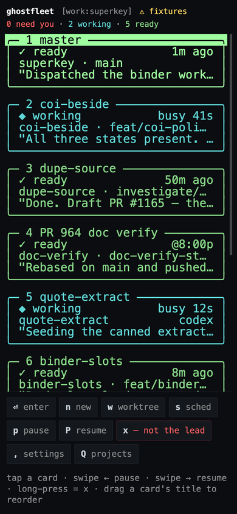
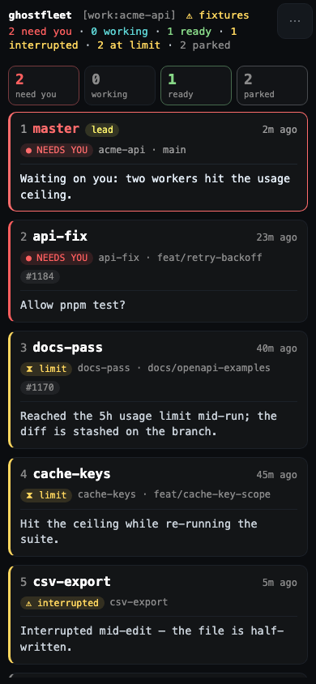
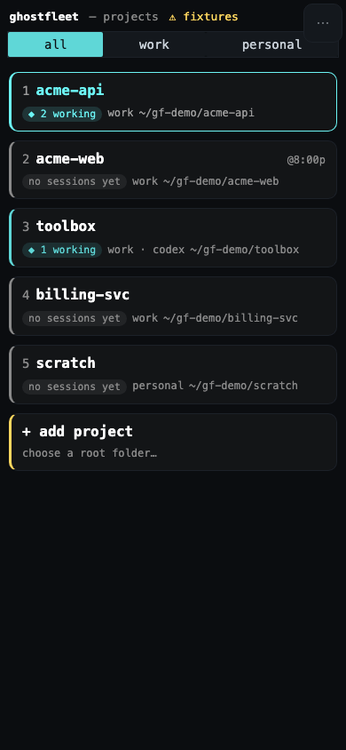
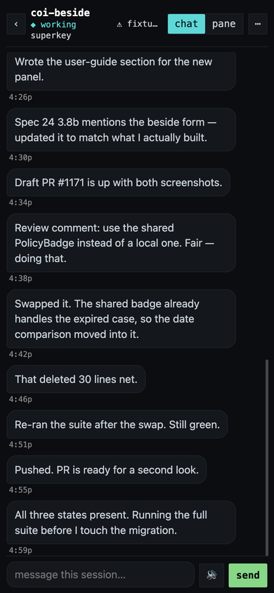
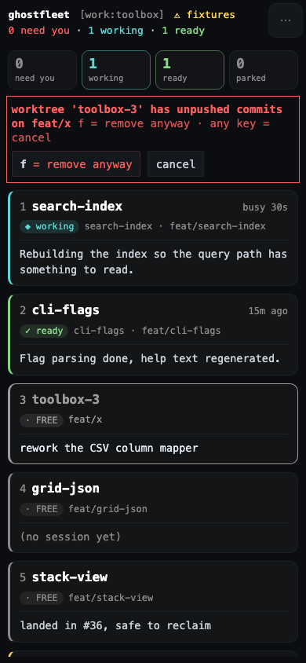

# web/ — the phone client

The fleet grid, as a Progressive Web App. Design: [`docs/mobile.md`](../docs/mobile.md)
— §4 is the JSON, §6 is the client and layout, §7 is parity and the confirmations.

It is **not a second design**. `bin/fleet-grid.mjs` computes its column count from the
window width (`const nc = cols()`), so a phone is `nc = 1`, and the card is the same
five lines `cardLines()` draws — the same box-drawing characters, the same 32 columns,
the same nine statuses with the same glyphs and colours. `web/grid.js` is a
transcription of those functions, and `test/helpers/grid-parity.mjs` **lifts the real
ones out of `fleet-grid.mjs` and diffs their output against it, card for card**. That is
the only thing keeping the two in step, because this kind of drift is silent: a card
that still renders is a card that still looks right.

```
╭─ 1 coi-beside ───────────────╮
│ ◆ working            busy 41s│   status left · age right (or ↻ reset, or @scheduled)
│ coi-beside · feat/coi-polic… │   worktree · branch  (+ agent when it isn't claude)
│ "All three states present. R…│   last message, quoted
╰──────────────────────────────╯
```

| the grid, `nc = 1` | all nine statuses | projects |
|---|---|---|
|  |  |  |

| a session | the TUI's own confirmation, and its force step |
|---|---|
|  |  |

## Running it

Zero dependencies, no build step, no `npm install` — plain HTML, CSS and ES modules that
any static server can serve:

```bash
cd web && python3 -m http.server 8000     # or any static server
open http://localhost:8000
```

`localhost` matters if you want the passkey: WebAuthn needs a secure context, and
`http://` on a LAN or tailnet IP is not one. The app says so rather than failing
mysteriously, and in fixture mode it offers a clearly-labelled way past — there is no
server there to protect.

## Which fleet it talks to

**Whoever served the page gets asked first.** On boot, with nothing configured, the
client `GET`s `/api/health` on its own `location.origin`:

| the origin answers | the client runs on |
|---|---|
| a JSON envelope — **including a 401** | that origin, over the tailnet |
| a 404, an HTML page, or nothing at all | the bundled `fixtures/` |

A **401 is the proof**, and a stronger one than a 200: it says the endpoint exists *and*
that the passkey is being enforced there (§5). Requiring a successful authenticated call
would be worse than useless — at first run nothing is enrolled, so there is nothing to
authenticate with, and the client would fall back to fixtures on the very machine serving
it. Which is exactly what it used to do: `gf.base` unset meant "fixtures", nothing ever
set it, and a phone opening the daemon's own URL was shown four sample projects that do
not exist on this machine while `fleet-serve clients` reported `(no clients enrolled)` —
the client had never made a request.

So `cd web && python3 -m http.server 8000` still lands in `fixtures/`, which is how this
client gets reviewed, and **an explicit setting still wins in either direction**:

| `gf.base` | means |
|---|---|
| absent (or `''`) | ask this page's origin — the default |
| `'fixtures'` | fixtures, even when `fleet-serve` is what served the page (for a demo) |
| `'http://mac.tailnet.ts.net:8787'` | that origin, whatever served the page |

"Unset" and "fixtures" have to be **different values**; while they were both the empty
string, the only safe reading of unset was the wrong one. Set it in **settings →
connection**, which offers those same three choices, or from a console with
`localStorage.setItem('gf.base', …)`.

The resolved mode is in the **header on every screen** — `⚠ fixtures` in yellow, or the
origin it is talking to — because the lock screen that explains it is the one thing you
dismiss.

## Files

| | |
|---|---|
| `index.html` | the shell — small on purpose, it is what a cold offline open paints |
| `grid.js` | the cards, as strings. Mirrors `cardLines`/`newCardLines`/`freeCardLines`/`boxCard`/the counts header. No DOM, no fetch |
| `app.js` | the three screens, the four gestures, the verbs and the confirmations |
| `api.js` | **the only file that talks to the network**, the fixture backend, and the probe that decides between them |
| `ansi.js` | the pane, as HTML: SGR escapes → coloured spans, cells → 1ch boxes. Pure, no DOM, no fetch |
| `passkey.js` | the WebAuthn ceremonies (§5, §7) |
| `sw.js` | offline: cache-first for the app, network-first with fallback for `/api/*` |
| `fixtures/` | §4 payloads, and the projects/checkouts/settings/session/pane reads |
| `icons/make-icons.mjs` | rasterises the grid's own `SHIP` sprite into the home-screen icons |

## Screens and gestures

Projects → grid → session, mirroring the desktop. **A tap on a card lands on a chat** —
bubbles, oldest-first, with a composer — and **the session's real tmux pane is one tap
away** (`capture-pane -p -e`, rendered by `ansi.js`, which is what `⏎` on a card gets you
at the desk). Both are kept because they are different things: the chat is the readable
one and pages back over the whole transcript, the pane is the only place a permission
dialog exists at all. A **blocked** session says so in the chat, in red, with a button to
the pane — that banner is what makes the chat safe as the default (§7a).

The **back gesture** works: navigating pushes a history entry that reuses the current href,
so a swipe walks session → grid → projects and **no URL ever appears**.

The session screen's ten footer buttons are one **`⋯` actions sheet**. The composer replaced
`send a prompt`, and a **`🔊`** beside it reads the newest assistant turn aloud
(`SpeechSynthesis` — no network, and fenced code is announced rather than read out).

§7's key-to-touch mapping:

| terminal | phone |
|---|---|
| `1-9` / `⏎` | tap a card |
| `q` / back | the system back gesture, or `‹` in the session bar |
| `⇧hjkl` reorder | drag a card **by its title line** (the grip — the rest of the card still scrolls) |
| `p` / `P` | swipe ← pause · swipe → resume |
| `x` | long-press |
| `,` settings · `Ctrl-p`/`Q` projects · `q` back | buttons in the footer bar, key letter included |

The keyboard bindings are wired too — the same letters — so a desktop browser or a
Bluetooth keyboard behaves like the TUI.

**Two things are deliberately absent** (§7), and a substitute for either is the mistake:

- **the stack** — it exists to put four sessions side by side, and a phone has no side.
  At `nc = 1` that is this card list.
- **`Ctrl-t` terminal / `Ctrl-n` editor tabs** — they open a shell and neovim in the
  session's folder. There is no local shell on a phone, and streaming a remote one is a
  bigger surface than the whole rest of the design.

The settings sheet says both out loud, so the gap reads as a decision rather than as
something half-built.

## Destructive verbs

`spawn` and `stop --reclaim` are in scope — a read-only phase was considered and
rejected (§7): an app that reports a worker has been blocked since 9pm and cannot answer
it has not solved the problem, it has described it more conveniently.

What stands in front of them is identity and confirmation, not reduced capability:

- **the TUI's own prompts, reproduced verbatim** — `kill session 'x'?`,
  `remove worktree 'api-3' (feat/x)?`, `y = yes · any other key = cancel`, and
  `f = remove anyway` as its **own** key. `pwa-check.mjs` reads those strings out of
  `fleet-grid.mjs` and asserts the phone carries the same ones.
- **a passkey at the moment of action** for `spawn`, `stop`, `rename` and removing a
  worktree, plus one at every open and after the app has been backgrounded.
  `stop --reclaim` takes **both** confirmations, because it is the one verb that can
  delete work (§12).
- **an audit row for every mutating call**, visible in settings.

- **the lead is not a worker.** `master` is a card here (§4's `lead`) because a phone is
  the only way to reach it, and its card looks exactly like a worker's — so `stop`,
  `stop --reclaim` and `rename` are not drawn on it, and the screen says why rather than
  leaving three buttons quietly missing. The gate reads §4's `lead` flag, never the name.

None of that is the enforcement. §5: *server-enforced, not client-enforced* — the
assertion's job is to make the server mint a short-lived token, and the server refuses
anything without a live one. The lists in `api.js` decide which taps ask for a
fingerprint; `curl` never runs them. The lead is refused the same way: in `plan()`
(`mcp/fleet-dispatch.mjs`), which is the layer both the MCP server and the daemon go
through, so the button being absent is a courtesy and not the control.

## What `fleet-serve` has to answer

```
GET  /api/projects                          -> { home, projects: [ … ] }
GET  /api/grid?project=<name>               -> docs/mobile.md §4, verbatim
GET  /api/session?project=&session=&limit=20[&before=<ts>]
                                            -> { session, total, messages: [{ts,role,text}], next_before, note? }
GET  /api/pane?project=&session=[&scrollback=0..2000]
                                            -> { ok, project, session, scrollback, at, pane: "<SGR text>" }
GET  /api/checkouts?project=<name>          -> { roots, checkouts }
GET  /api/settings?project=<name>           -> { global_nudge, sessions: { name: on|off|inherit } }
POST /api/verb   { tool, args }             -> { ok, text }         Bearer token required
GET  /api/auth/challenge                    -> { challenge, rp_id, user, enrolling }
POST /api/auth/register { code, id, … }     -> { token, expires_at }
POST /api/auth/assert                       -> { token, expires_at }
GET  /api/health                            -> { ok, version, … }    the probe's target
```

### Enrolling the phone

`code` on register is **not optional**. `fleet-serve` refuses a registration that no
window and no one-time code authorised, and it is right to: the endpoint is remote code
execution, and trust-on-first-use loses to whoever wins the race to be first. On the Mac:

```bash
fleet-serve enroll phone      # prints e.g.  GP7CX-ZRDR5  — 15 minutes, one use
```

The lock screen offers **enrol this phone** whenever the client is in server mode with no
credential for that origin, and the sheet behind it takes the code. Case and the hyphen do
not matter (the client normalises exactly as the server does), and the sheet asks
`/api/auth/challenge` whether a window is even open *before* spending a Face ID prompt on
a refusal. When the server does refuse, **its own sentence is what you see** — "no
enrolment is open…" and "wrong or missing enrolment code…" are the only things that say
what to do next, and `register → HTTP 403` is not.

A credential is stored per backend (`gf.cred:<origin>`, or `gf.cred:fixtures`), so a
passkey registered against the bundled fixtures is not offered as one for a server. It
used to be: the phone had registered in fixture mode, so the lock screen offered "unlock
with Face ID", the assertion 401'd, and the button looked broken. Nothing is stored at all
until the server has accepted the attestation, for the same reason — a refused
registration that left a credential behind put the app straight back into that state.

`tool` is the **MCP tool name, unchanged** — `fleet_list`, `fleet_send`, `fleet_read`,
`fleet_spawn`, `fleet_worktrees`, `fleet_inbox`, `fleet_answer`, `fleet_pause`,
`fleet_resume`, `fleet_stop`, `fleet_rename`, `fleet_project_add`, `fleet_projects` — so
the daemon dispatches through the handlers it already has (§2) rather than growing a
second vocabulary.

Eight more are things the **grid** does by writing a marker file or calling a sibling
script, and have no MCP tool today. They are the only additions this client asks for:

| verb | what the TUI does today |
|---|---|
| `fleet_schedule` | `s` — writes `<sock>.<session>.sched` and spawns `bin/fleet-schedule` |
| `fleet_label` | `l` — the display label on a card |
| `fleet_nudge` | per-session / per-project `notify-lead` markers |
| `fleet_budget` | per-project "ignore the usage ceiling" marker |
| `fleet_order` | `⇧hjkl` — `<sock>.order` plus the `@cf_order` tmux option |
| `fleet_project_order` | `⇧hjkl` on the Projects screen |
| `fleet_project_remove` | `x` on the Projects screen — the list entry only |
| `fleet_worktree_remove` | `x` on a **FREE** card, and the `force` that follows a refusal |

Two notes for whoever wires the server up:

- **Serve `.js` as `text/javascript` and `.webmanifest` as `application/manifest+json`.**
  A module served as `text/plain` is blocked outright, and the failure looks like a blank
  page.
- **`web/package.json` is `{"type":"module"}` for node's benefit, not the browser's** —
  it is what lets `node --check` and the test helpers read these `.js` files as ES
  modules. Don't remove it.

## The pane

`/api/pane` is `tmux -L <sock> capture-pane -p -e -t <session>`, scoped by the fleet's
socket and targeted as a bare `-t <name>` like every other reader here. `-e` keeps the SGR
escapes, which is the whole point: colour and attributes are how the TUI tells a tool
header from prose.

**It never attaches and never resizes.** Attaching would make the daemon a tmux *client*,
and a client sizes the window to fit itself — a phone attaching to a 269-column pane
reflows the agent's window to ~40 columns, and the desktop finds its session cropped.
`capture-pane` only reads. Asserted three ways in the suite, including that no client is
ever attached after the whole probe has run.

**Width is the honest problem and it is not solved, it is offered twice.** The pane was
captured at whatever the desktop layout gave it — 269 columns on this machine's fleets,
measured — and a phone is ~40. It is never wrapped or reflowed: a wrapped TUI is
unreadable and stops being the thing you came to look at. So it scrolls sideways inside its
own box (never the page body), and the zoom row gives both readings — `fit` scales the whole
pane in to see its *shape*, `±` takes it back to a size you can read and pan across.

`ansi.js` keeps the two rules the cards learned the hard way. **Bold is never
`font-weight`** — the bold face has no box-drawing glyphs, so a weight change moves
`─ ╭ ╮ ╰ ╯` and not `│` (366px → 517px on one line, measured), so SGR 1 renders as the
bright half of the palette instead. **One cell per cell** — through the same `cells()` the
cards use, boxed at 1ch, or 2ch where tmux gave the character two columns.

**Polling: 2s while the pane is on screen, 4s with `history` on, and nothing at all while
the page is hidden** — the timer is cleared on `visibilitychange`, not left to skip its
turns, because a phone that wakes its radio every two seconds in a pocket has already paid
the cost. With `refresh()`'s 5s grid poll that is ~42 reads/min against `serve.json`'s
240/min ceiling.

## Pagination

20 messages, with an explicit "load more" (§11.3). That bound is about **not pulling
46 MB down a tunnel on cellular** — it is a performance decision, not a security
control, and content is served **unredacted**. Anything that describes it as a redaction
has misread the design. `/api/pane`'s `scrollback` is the same kind of bound for the same
reason: 0 is exactly what an attach shows, and more rows cost more bytes.

## Offline

The service worker precaches the app and the fixtures (cache-first) and keeps the last
successful `/api/*` response (network-first, falling back to it). `app.js` also mirrors
the last payload into `localStorage`, so a cold open with no network paints the fleet as
it was and labels it `⚠ offline — last fetched 9:04p` instead of showing a blank page. A
stale grid with a timestamp beats an error page; a stale grid presented as live would be
the lie.

Cache-first is also the deploy hazard, and it is the phone that pays it. After a
`cf-sync` a phone that already has the app runs the `app.js` **it** cached, so the first
look after a deploy can be the old client — indistinguishable from the fix not working.
Bumping `sw.js`'s `VERSION` (and the `CLIENT-HASH` the suite pins to it) is what lands the
new bytes; it does not re-parse a page that is already open, and reopening an installed
iOS PWA from the app switcher is a resume, not a navigation. Swipe it away and relaunch.
The tell is on the server, not the phone: the chat client polls `/api/session`, and the
pane-first client that preceded it polls `/api/pane`.

## Tests

```bash
./test/run.sh                          # the suite, including the three helpers below
node test/helpers/grid-parity.mjs      # phone card == TUI card, line for line
node test/helpers/pwa-check.mjs        # self-containment, precache, icons, §4 fixtures, §7 prompts
node test/helpers/pane-check.mjs      # the pane renderer, against real `capture-pane -e` bytes
node test/helpers/pane-render.mjs     # < an /api/pane body: what a phone would SHOW, as text
node test/helpers/pwa-origin.mjs <base>            # which backend it picks, against a LIVE fleet-serve
node test/helpers/pwa-render.mjs <base>            # app.js actually RUNS, and paints what it decided
node test/helpers/pwa-enrol.mjs <base> <code> <id> # the enrolment ceremony, end to end
```

All of them emit `name <US> want <US> got` rows that `test/run.sh` feeds to its own `is`.
Every assertion in them was watched going red before it was trusted — a two-column glyph,
a folded `unknown`, a swapped counts clause, a reworded confirmation, a fixture left out
of the precache, a CDN link in the HTML, a same-origin default put back to fixtures, a
registration that forgets the enrolment code, and a fixture passkey counted as a server's.

`pwa-render.mjs` builds a ~60-line DOM and **imports `app.js` for real**, because
`node --check` proves syntax and not that it runs — this file has already been blank once
from a ReferenceError in a version that parsed perfectly (see the boot block's comment).
It reads back the painted text: which origin the lock screen names, that server mode
offers *enrol this phone* and hides the fixture bypass, and that the header says
`⚠ fixtures` once you are past the lock.

`pwa-origin.mjs` wants a real `fleet-serve` on loopback (`run.sh` starts one and passes
its base), because the signal the client leans on is a **response nobody wrote down** —
the 401 a cold, unenrolled daemon gives — and the whole point is that it is measured
rather than assumed. It brings its own static servers for the other direction, including
one with an SPA fallback, which answers `200 text/html` for `/api/health` and is the case
a status-only check reads as success.
